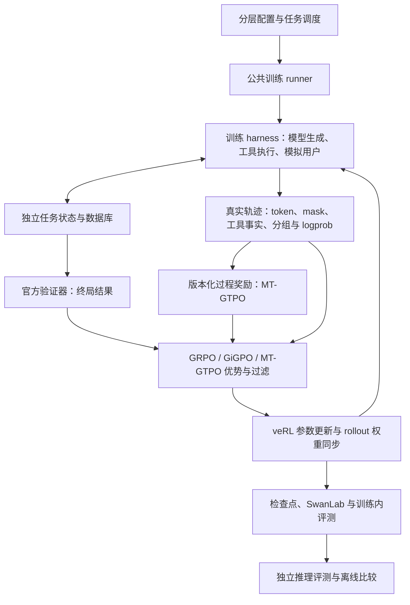

# Tau3-GRPO：多轮工具智能体训练与评测

基于固定版本的 **veRL + Tau3 benchmark**，支持 **GRPO、GiGPO 和 MT-GTPO**：策略模型在独立任务环境中调用工具、与模拟用户交互，验证器判定结果，算法计算优势，veRL 更新策略。项目同时提供 SFT、独立评测、轨迹重放和实验记录。

**截至 2026-09-20，本轮架构重构与约定的 GPU 工程／接口验收已完成。** 这证明采样、更新、权重同步、保存／恢复和评测接口在已测范围内接通；不代表重构后的算法已完成正式 20-step 对照、多 seed 消融或已证明性能提升。不同奖励配方、模型、硬件与并行方式须分别验证。

|入口|用途|
|---|---|
|[当前实验](docs/CURRENT_EXPERIMENT.md)|已有结果、正式协议与候选状态|
|[工程验收报告](docs/architecture/interface_acceptance_20260919.md)|CPU/GPU 实测、接口范围、恢复和独立评测证据|
|[实验记录](EXPERIMENTS.md) / [错误记录](ERRORS.md)|实验索引、失败原因与修复影响|
|[架构说明](docs/architecture/layout.md) / [开发标准](docs/architecture/development_standard.md)|模块职责、配置接入、证据和新增代码规范|
|[活动配置索引](configs/experiments/catalog.yaml)|正式入口、算法、奖励配方和候选状态|
|[剩余工作](docs/architecture/remaining_work_20260919.md) / [消融计划](docs/architecture/ablation_plan_20260918.md)|正式效果研究、消融与后续工程事项|

## 架构与 harness



**Harness** 是一次任务如何执行的流程：建立独立状态，解析模型动作，执行同轮多个工具调用，返回 observation，推进模拟用户，处理终止并记录轨迹。训练侧由 `envs/` 与 veRL agent loop 配合完成，独立评测使用 benchmark Orchestrator 和项目评测 runtime。两者共用评分规则，但并不是同一个执行器；工具顺序、预算和异常处理需要单独核验。

环境／验证器定义可验证结果，过程奖励提供显式版本的学习信号，算法负责优势和信用分配，veRL 负责优化更新。过程奖励不能充当官方成功率，基础设施失败不能混成模型零分。算法和 harness 允许继续修改，每次行为变化保存配置、版本、对照与验证证据。

|算法|训练信号|选择方式|
|---|---|---|
|GRPO|终局 outcome 的组内相对优势|`--estimator grpo`|
|GiGPO|episode 信号与可见状态 anchor 的 step 信号|`--estimator tau_gigpo`|
|MT-GTPO|终局和显式版本过程奖励的混合信用分配|`--estimator mt_gtpo --reward-version v3`|

`--dynamic-filter` 独立开启动态过滤。MT-GTPO 按联合优势判断整组有效信号，保持固定候选 rollout 预算，过滤后不补采样。语义 anchor、paper-derived 奖励等候选的开发状态见配置索引；当前实现不声称完整复刻外部论文算法。

## 目录职责

```text
code/
├── configs/                  模型、硬件、数据、协议、算法与奖励配置
├── scripts/                  数据、训练、评测、服务和维护的薄入口
├── tau3_grpo/
│   ├── configuration.py      配置组合、覆盖顺序与来源记录
│   ├── training/             SFT/RL、公共 runner、服务与检查点管理
│   ├── algorithms/           优势、过滤和 anchors
│   ├── envs/                 会话、工具、任务状态与模拟用户
│   ├── evaluation/           验证、过程奖励、独立评测与严格比较
│   ├── integrations/verl/    estimator 注册和 batch/tensor 适配
│   ├── data/ / models/       数据契约、可见消息、模板与模型兼容
│   └── analysis/ / tracking/ 离线重放、诊断、SwanLab 与实验身份
├── tests/                    分层 CPU 回归及专用 GPU 检查
├── docs/ / env_info/          开发标准、历史证据和部署环境
├── verl/ / tau2-bench/        固定上游源码与登记补丁
└── EXPERIMENTS.md / ERRORS.md  实验与错误的唯一索引
```

`configs/` 存参数，`scripts/` 存入口；相似子目录表示用途对应，公共实现集中在 Python 包内。[上游身份与补丁](THIRD_PARTY_SOURCES.md)固定登记，目录和 Python 包名 `tau2` 不代表 benchmark 版本判断。

## 安装与 CPU 检查

在仓库根目录使用 Python 3.12：

```bash
bash setup.sh cpu-test
source .venv-cpu/bin/activate
python -m pip install ruff==0.16.6

python scripts/maintenance/check_cpu.py --suite core
python scripts/maintenance/check_lint.py
python -m tau3_grpo.integrations.vendor_inventory
```

CPU 检查分为 `core`、`benchmark`、`verl`；`--list` 可列出用例。后两层依赖相应的固定 benchmark、数据和框架环境，不能以 Mac CPU 结果代替 A800 集成。Lint 检查拒绝新增问题，历史债务显式登记；不宣称全仓库零告警。GitHub Actions 执行核心 CPU 检查，不启动 GPU。

Qwen3.5 Linux/A800 安装入口为 `bash setup.sh a800-qwen35`，旧 Qwen2.5 环境入口为 `bash setup.sh a800`；详见 [环境说明](env_info/README.md)。已有部署复用原环境，不把 Mac 虚拟环境复制到 Linux。

## 正式训练与配置

公共入口为 `python -m tau3_grpo.training.rl.runner`，安装后的别名是 `tau3-formal-train`。基础 profile 为 `configs/train/rl/formal50_a800.yaml`，组合协议、模型、硬件、数据和模拟器组件；MT-GTPO 再选择算法与奖励组件。

以下预检需在已配置模型、数据及 veRL 的远程环境执行。`--dry-run` 会校验输入、生成配置及运行目录，不启动模型服务或训练：

```bash
source /root/autodl-fs/tau3-core/activate.sh
cd "$CODE_ROOT"

python -m tau3_grpo.training.rl.runner \
  --estimator grpo --updates 20 \
  --result-dir results/runs/grpo_formal/example_s42 --dry-run

python -m tau3_grpo.training.rl.runner \
  --estimator tau_gigpo --updates 20 \
  --result-dir results/runs/gigpo_formal/example_s42 --dry-run

python -m tau3_grpo.training.rl.runner \
  --estimator mt_gtpo --reward-version v3 --dynamic-filter --updates 20 \
  --result-dir results/runs/mt_gtpo_formal/example_s42_df1 --dry-run
```

当前正式对照：Qwen3.5-4B `new-off` SFT 起点、非 thinking、全语言参数 RL、train50、seed42、20 个外层 step；每步 8 组 × 8 条，共 1,280 条候选，学习率 `1e-6`、KL `0.01`，独立 Qwen3.8-27B-AWQ-INT4 模拟用户。历史部署为 4 张 A800 策略卡 + 1 张模拟器卡，其他硬件组合须另验。

每 10 step 保存完整检查点并评测 selection60×4，核验新检查点后仅保留最新 1 份。SwanLab 每步记录真实 `global_step`，续训使用原 run ID 和 `--resume-from`；正常停止通过运行目录的 `STOP_AFTER_BOUNDARY` 请求，在整十节点完成保存和评测后退出。恢复前需检查已有记录，不能直接覆盖运行目录。

GPU 实验须先确认目的与预算；移除 `--dry-run` 会真实使用 GPU。短程工程计划、历史日期 profile 和正式 20-step 配置分别保留，不能混用预算。Paper 系列配方还需要与训练 manifest 匹配、通过校验的 `--reward-recipe`。

SFT 继续使用 `bash scripts/train/sft/run.sh --config configs/train/sft/qwen35_full.yaml --dry-run`；历史通用 RL shell 入口保留兼容与复现用途。详见 [操作流程](docs/workflow.md) 和 [开发标准](docs/architecture/development_standard.md)。

## 评测、增幅与可靠记录

- 单模型独立评测：`python -m tau3_grpo.evaluation.run --help`；批次管理：`evaluation.controller`。
- 离线比较：`python -m tau3_grpo.evaluation.compare --baseline RUN_A --treatment RUN_B --output-dir NEW_REPORT`，不调用模型。
- 指标包含 pass@1/2/4、pass^k、绝对百分点差、相对变化和按任务配对 bootstrap 置信区间；基线为零时相对增幅为空。
- 先核对完整 task/trial/seed 计划及协议，再比较结果。异常或未完成评测不取交集、不覆盖原失败，不把缺失成本字段当零。
- 轨迹保留原始 token/mask、工具事实、终止原因、分组和实际生成 logprob；配置、源码、模型、任务／数据库身份与回执共同支持重放。

训练及内部选型使用固定版本的 AReaL Tau2 风格 Airline 数据；**官方 final50 仅用于模型和协议确定后的最终评估**。历史开发数据不能重新称为盲测集。单 seed 的任务置信区间不能代替多训练 seed 结论。[独立评测说明](docs/independent_evaluation.md)记录具体协议。

## 已验证范围与后续工作

2026-09-19～20 的工程验收：

|检查|实测结论与范围|
|---|---|
|CPU / GPU 数值|远程 CPU 1,302 passed、15 GPU skipped；独立 GPU-only 17 passed、4 CPU deselected；不同集合不相加|
|三算法增强接口|各 4 条、共 12 条真实轨迹；分组、trial、data-seed、生成 logprob、mask 和工具执行通过|
|更新与权重同步|GRPO/GiGPO 两步更新通过；MT-GTPO DF off/on 各两步、128 候选通过。增强接口和 MT 更新覆盖 331 个活动文本参数逐值映射，vision 排除|
|GiGPO 恢复|四 rank 模型、optimizer、scheduler、RNG 实际加载；step2→3、同云端 run 步数及数据指针核对通过|
|导出与独立推理|724 个张量核验、实际加载、2 任务×4 次共 8/8 完成、0 异常；属于工程小样本|
|MT-GTPO 重放|DF off/on 的过程奖励、优势、过滤、完整保存和云端步数通过；DF on 两批实际未剔除组，不作过滤收益结论|

权重审计限定 dense 文本、TP1、未量化、无 LoRA；不推广到全部多模态、并行与量化场景。完整证据及历史失败见 [最终接口报告](docs/architecture/interface_acceptance_20260919.md)。已退役的工程检查点保留验收记录，不再支持对应节点精确续训。

下一阶段是正式 20-step 效果对照、多 seed／机制消融，以及按需求扩展尚未验证的配置。工程通过与算法收益分别报告。

## 源码与运行资产

`models/`、`checkpoints/`、`.venv*`、生成数据、大部分 `results/` 和凭据不进入 Git。已审核、固定的数据输入及课程 manifest 是显式例外，见 [数据清单与校验](data/README.md)。完整轨迹、权重和维护回执位于运行资产中，GitHub 克隆不会包含这些大文件；文档中的证据路径用于在实验部署中定位。

可通过 `TAU3_DATA_ROOT`、`TAU3_MODEL_ROOT`、`TAU3_RUN_ROOT`、`TAU3_CACHE_ROOT` 指定资产路径；一般入口默认对应 `code/{data,models,results,.cache}`，正式 profile 的显式路径以实际配置为准。使用 `.env.example` 配置凭据，不提交 `.env`。

当前远程主代码为 `/root/autodl-fs/tau3-core/code`，环境在同级 `environment/`；模型资产经链接分布在系统盘／数据盘，实验输出保存在持久盘。详情见 [维护约定](AGENTS.md)、[存储说明](docs/storage.md) 和 [代码历史](docs/code_history.md)。本地目录还可能包含 CPU 环境和下载的实验证据，目录总大小不等于源码大小。

项目自有代码采用根目录许可证；第三方源码和数据保留各自条款，详见 [第三方来源](THIRD_PARTY_SOURCES.md)。
