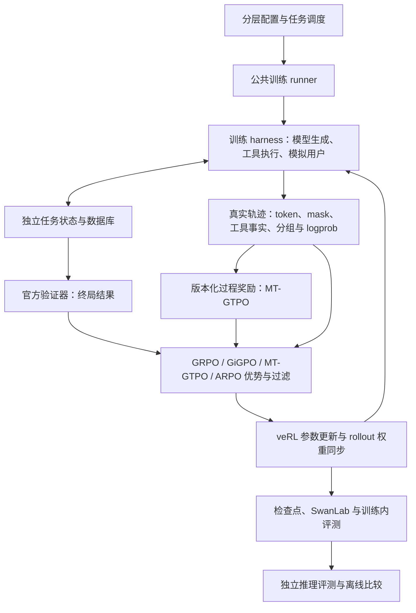

# Tau3-GRPO：多轮工具智能体训练与评测

基于固定版本的 **veRL + Tau3 benchmark**，支持 **GRPO、GiGPO、MT-GTPO 和 ARPO（CPU 已验收）**：策略模型在独立任务环境中调用工具、与模拟用户交互，验证器判定结果，算法计算优势，veRL 更新策略。项目同时提供 SFT、独立评测、轨迹重放和实验记录。

**当前主线（2026-09-30）：完成 Codex 审核的 train500/dev150，再开展 A109 → B393 → C500 三阶段 SFT 与同起点 GRPO / ARPO 对照。** 旧 Codex-only 500/150 包的 ready 声明已撤回；本轮正在替换错误对话和冻结新证据。新课程尚未开始训练。此前的三算法工程验收与旧 repair72 GRPO 结果分别保留，不能当作新课程或 ARPO 的效果证据。

|入口|用途|
|---|---|
|[当前实验](docs/CURRENT_EXPERIMENT.md)|已有结果、正式协议与候选状态|
|[工程验收报告](docs/architecture/interface_acceptance_20260919.md)|CPU/GPU 实测、接口范围、恢复和独立评测证据|
|[实验记录](EXPERIMENTS.md) / [错误记录](ERRORS.md)|实验索引、失败原因与修复影响|
|[架构说明](docs/architecture/layout.md) / [开发标准](docs/architecture/development_standard.md)|模块职责、配置接入、证据和新增代码规范|
|[活动配置索引](configs/experiments/catalog.yaml)|正式入口、算法、奖励配方和候选状态|
|[剩余工作](docs/architecture/remaining_work_20260919.md) / [消融计划](docs/architecture/ablation_plan_20260918.md)|正式效果研究、消融与后续工程事项|

## 当前计划：三阶段 SFT → GRPO / ARPO（2026-09-28）

当前主线是先完成课程 SFT，再从**相同的 SFT checkpoint**分别运行 GRPO 和 ARPO。已完成的是数据验收、旧 repair72 GRPO 实验和 ARPO 的 CPU 接入；新的三阶段 SFT、课程起点的 RL 对照及 ARPO GPU 实验尚未执行。

### SFT：按能力递进，后阶段保留前阶段数据

目标为 **500 条训练对话 + 150 条独立开发对话**；当前收尾状态和历史 ready 声明撤回原因见 [收尾记录](docs/sft_finalization_20260930.md)。历史 500/37 为混合审核包，不代表新的 Codex-only 500/150 已验收。训练集由基础 109、多约束 284、多步策略 107 条组成；累计子集是 **A109 → B393 → C500**，不是三份互不重叠的数据。

|阶段|累计训练数据|训练重点|验证重点|
|---|---:|---|---|
|A：基础|109|理解意图、读取证据、工具选择、schema 与参数绑定、正确收尾|基础工具与证据正确性，同时检查合规和完成情况|
|B：约束|393（109 + 284）|多条件执行、费用与支付、用户确认、政策边界、写入后核验|约束满足和确认流程，同时回归 A 的能力|
|C：策略|500（393 + 107）|多步状态依赖、合法替代、失败后重规划、端到端完成|多步策略和整体完成，同时回归 A/B 的能力|

计划从同一确定的基座依次进行 **A → B → C 续训**，每阶段根据独立 dev 的任务表现选择 checkpoint 后进入下一阶段；dev 不参与梯度训练。基座版本、学习率、各阶段 epoch/token 预算和选择规则需在实际训练前冻结，不能把数据划分当作已验证训练方案。直接用 C500 一次训练可作为单阶段 SFT 基线，比较时应报告并对齐总训练 token/更新预算。

数据有原生工具执行、完整数据库状态、语义审核来源、token/mask 与文件哈希记录；历史 Codex、Kimi 和 GPT-6-sol high 审核分别保留来源，不把机械回放等同于语义通过。旧数据保留追溯；新包采用独立目录，训练入口会核验文件、审核证据和实际 tokenizer/mask 哈希。

### 开发集：37 → 150，阶段诊断与共同评测并存

- **当前已验收 37 条，目标扩充到 150 条**；新增 113 条合格数据尚未交付。最新安排是 DeepSeek 先生成候选、语义审核后置，未经审核的候选不计入合格 dev。
- 按五维 rubric、[九类能力](configs/analysis/airline_capability_taxonomy.yaml)和 [badcase 回放分类](configs/analysis/airline_badcase_replay_20260925.json)补覆盖，重点补多约束、费用与政策边界、状态依赖和重规划。目标约基础/约束/策略各 50 条，不能为凑数改标签或降低标准。
- A/B/C 阶段各看相应能力切片，但五维标准始终保留；关键 checkpoint 用**同一套冻结的完整 dev150**比较，并检查前阶段能力退化。不能只比较各阶段自身 loss。
- train/dev 保持用户、任务来源隔离并检查重复。旧 **selection60** 已有开发曝光，保留为独立的历史回归面板，**不并入新 dev150，也不称为盲测**；已有用户隔离检查不等同于全部泄漏检查完成。
- **官方 final50** 在模型和协议冻结后做最终测试，不用于课程选型或调参。

### 对应 RL：相同 SFT 起点，分别比较 GRPO 与 ARPO

|SFT 起点|SFT-only 基线|GRPO 分支|ARPO 分支|
|---|---|---|---|
|A 阶段选定 checkpoint|基础能力与完整 dev 表现|同一起点做终局奖励组相对优化|同一起点做工具后自适应分叉 + soft GRPO|
|B 阶段选定 checkpoint|约束能力及 A 回归|同一起点强化多约束完成|同一起点探索工具反馈后的其他续写|
|C 阶段选定 checkpoint|整体完成及 A/B 回归|同一起点做完整任务优化|同一起点做多步分叉探索与 soft 归因|

上表是计划中的对照矩阵，未启动这些新实验。两种算法分别从对应的同一 SFT checkpoint 启动，**不把 GRPO 后的模型作为 ARPO 起点**。具体先跑哪些阶段、训练与评测预算在执行前冻结；SFT-only、GRPO、ARPO 使用同一任务集、奖励协议、模拟用户和推理参数。

当前可复用的工程模板是两张 A800、LoRA16、每步 4 组 × 8 条 = 32 条、20 步共 640 条训练候选，每 10 步保存完整检查点。它们仍绑定 **repair72 旧起点与旧 selection60 协议**，不是可直接启动的新课程实验：

|实现|入口/配置|状态|
|---|---|---|
|GRPO|`--estimator grpo`；[full-eval profile](configs/train/rl/repair72_grpo_2xa800_shared32_full_eval.yaml)|旧 repair72 正式 20 步已完成；0/10/20 各 selection60×4，云端步数与收尾回执已验收|
|ARPO|`--estimator arpo`；[ARPO profile](configs/train/rl/repair72_arpo_2xa800_shared32.yaml)|`arpo_tau_v1` 已接入并通过 CPU 验证；真实 GPU 采样、更新、恢复和性能尚待验证|

旧 GRPO 的 selection 终局奖励均值为起点 **44.58%**、step10 **48.33%**、step20 **49.17%**。这是旧 repair72/旧 selection 的单次实验记录，不是新课程结果，也不代表盲测收益或已证明稳定提升。该实验收尾后，051 实例已按原任务授权关机；本次发布不启动或部署远程训练。

ARPO 依据 [论文](https://arxiv.org/abs/2507.19849)和[官方实现](https://github.com/RUC-NLPIR/ARPO)做 τ 适配：默认每组先采 4 条根轨迹、预留 4 个分叉名额，依据工具反馈后的熵变化选择续写分叉；隔离工具数据库，保留精确共享 token/mask/logprob 前缀，采用 soft GRPO 归因，评测保持独立完整轨迹。熵采用前 20 token 的 top-10 概率贡献代理量；这不是全词表精确熵，也不声称逐字复现官方算法。详见 [ARPO 规格与验证边界](docs/architecture/arpo_tau_v1.md)。

正式对照前，除起点、任务和奖励外，还须显式对齐 **loss 归约与模拟器种子策略**；现有 ARPO/GRPO 默认值并不完全相同。相同最终轨迹数也不等于相同计算成本，应同时记录生成 token、工具调用和 GPU 时间。课程起点、新 dev150 的配置接入及 ARPO GPU 验收都需完成后再开展效果比较。

计划来源为任务“2卡a800训练实战”的最新确认与本地验收回执；更多历史见 [SFT 数据记录](docs/sft_curriculum_evidence_build_20260927.md)、[GRPO 执行记录](docs/repair72_rl_and_curriculum_plan_20260927.md)和[实验索引](EXPERIMENTS.md)。完整数据/审核回执属于运行资产，未上传 GitHub；本地包位置为 `results/analysis/sft_deepseek_500_20260927/verified500_mixed_review_20260928/`，精确身份见 [数据包清单](docs/sft500_package_manifest_20260928.json)。

## 架构与 harness


```mermaid
flowchart TD
    C[分层配置与任务调度] --> R[公共训练 runner]
    R --> H[训练 harness：模型生成、工具执行、模拟用户]
    H <--> E[独立任务状态与数据库]
    H --> T[真实轨迹：token、mask、工具事实、分组与 logprob]
    E --> V[官方验证器：终局结果]
    T --> P[版本化过程奖励：MT-GTPO]
    V --> A[GRPO / GiGPO / MT-GTPO / ARPO 优势与过滤]
    P --> A
    T --> A
    A --> U[veRL 参数更新与 rollout 权重同步]
    U --> H
    U --> S[检查点、SwanLab 与训练内评测]
    S --> I[独立推理评测与离线比较]
```

**Harness** 是一次任务如何执行的流程：建立独立状态，解析模型动作，执行同轮多个工具调用，返回 observation，推进模拟用户，处理终止并记录轨迹。训练侧由 `envs/` 与 veRL agent loop 配合完成，独立评测使用 benchmark Orchestrator 和项目评测 runtime。两者共用评分规则，但并不是同一个执行器；工具顺序、预算和异常处理需要单独核验。

环境／验证器定义可验证结果，过程奖励提供显式版本的学习信号，算法负责优势和信用分配，veRL 负责优化更新。过程奖励不能充当官方成功率，基础设施失败不能混成模型零分。算法和 harness 允许继续修改，每次行为变化保存配置、版本、对照与验证证据。

|算法|训练信号|选择方式|
|---|---|---|
|GRPO|终局 outcome 的组内相对优势|`--estimator grpo`|
|GiGPO|episode 信号与可见状态 anchor 的 step 信号|`--estimator tau_gigpo`|
|MT-GTPO|终局和显式版本过程奖励的混合信用分配|`--estimator mt_gtpo --reward-version v3`|
|ARPO|工具后熵引导分叉，soft GRPO 归因|`--estimator arpo` + 显式 ARPO profile；GPU 待验收|

GRPO/GiGPO/MT-GTPO 可通过 `--dynamic-filter` 独立开启动态过滤；ARPO v1 不支持该过滤组合。MT-GTPO 按联合优势判断整组有效信号，保持固定候选 rollout 预算，过滤后不补采样。语义 anchor、paper-derived 奖励等候选的开发状态见配置索引；当前实现不声称完整复刻外部论文算法。

## 目录职责

```text
code/
├── configs/                  模型、硬件、数据、协议、算法与奖励配置
├── scripts/                  数据、训练、评测、服务和维护的薄入口
├── tau3_grpo/
│   ├── configuration.py      配置组合、覆盖顺序与来源记录
│   ├── training/             SFT/RL、公共 runner、服务与检查点管理
│   ├── algorithms/           优势、过滤和 anchors
│   ├── envs/                 会话、工具、任务状态与模拟用户
│   ├── evaluation/           验证、过程奖励、独立评测与严格比较
│   ├── integrations/verl/    estimator 注册和 batch/tensor 适配
│   ├── data/ / models/       数据契约、可见消息、模板与模型兼容
│   └── analysis/ / tracking/ 离线重放、诊断、SwanLab 与实验身份
├── tests/                    分层 CPU 回归及专用 GPU 检查
├── docs/ / env_info/          开发标准、历史证据和部署环境
├── verl/ / tau2-bench/        固定上游源码与登记补丁
└── EXPERIMENTS.md / ERRORS.md  实验与错误的唯一索引
```

`configs/` 存参数，`scripts/` 存入口；相似子目录表示用途对应，公共实现集中在 Python 包内。[上游身份与补丁](THIRD_PARTY_SOURCES.md)固定登记，目录和 Python 包名 `tau2` 不代表 benchmark 版本判断。

## 安装与 CPU 检查

在仓库根目录使用 Python 3.12：

```bash
bash setup.sh cpu-test
source .venv-cpu/bin/activate
python -m pip install ruff==0.16.6

python scripts/maintenance/check_cpu.py --suite core
python scripts/maintenance/check_lint.py
python -m tau3_grpo.integrations.vendor_inventory
```

CPU 检查分为 `core`、`benchmark`、`verl`；`--list` 可列出用例。后两层依赖相应的固定 benchmark、数据和框架环境，不能以 Mac CPU 结果代替 A800 集成。Lint 检查拒绝新增问题，历史债务显式登记；不宣称全仓库零告警。GitHub Actions 执行核心 CPU 检查，不启动 GPU。

Qwen3.5 Linux/A800 安装入口为 `bash setup.sh a800-qwen35`，旧 Qwen2.5 环境入口为 `bash setup.sh a800`；详见 [环境说明](env_info/README.md)。已有部署复用原环境，不把 Mac 虚拟环境复制到 Linux。

## 训练入口与历史 formal50 协议

公共入口为 `python -m tau3_grpo.training.rl.runner`，安装后的别名是 `tau3-formal-train`。基础 profile 为 `configs/train/rl/formal50_a800.yaml`，组合协议、模型、硬件、数据和模拟器组件；MT-GTPO 再选择算法与奖励组件。

以下预检需在已配置模型、数据及 veRL 的远程环境执行。`--dry-run` 会校验输入、生成配置及运行目录，不启动模型服务或训练：

```bash
source /root/autodl-fs/tau3-core/activate.sh
cd "$CODE_ROOT"

python -m tau3_grpo.training.rl.runner \
  --estimator grpo --updates 20 \
  --result-dir results/runs/grpo_formal/example_s42 --dry-run

python -m tau3_grpo.training.rl.runner \
  --estimator tau_gigpo --updates 20 \
  --result-dir results/runs/gigpo_formal/example_s42 --dry-run

python -m tau3_grpo.training.rl.runner \
  --estimator mt_gtpo --reward-version v3 --dynamic-filter --updates 20 \
  --result-dir results/runs/mt_gtpo_formal/example_s42_df1 --dry-run
```

历史 E0–E3 / formal50 对照：Qwen3.5-4B `new-off` SFT 起点、非 thinking、全语言参数 RL、train50、seed42、20 个外层 step；每步 8 组 × 8 条，共 1,280 条候选，学习率 `1e-6`、KL `0.01`，独立 Qwen3.8-27B-AWQ-INT4 模拟用户。历史部署为 4 张 A800 策略卡 + 1 张模拟器卡，其他硬件组合须另验。

每 10 step 保存完整检查点并评测 selection60×4，核验新检查点后仅保留最新 1 份。SwanLab 每步记录真实 `global_step`，续训使用原 run ID 和 `--resume-from`；正常停止通过运行目录的 `STOP_AFTER_BOUNDARY` 请求，在整十节点完成保存和评测后退出。恢复前需检查已有记录，不能直接覆盖运行目录。

GPU 实验须先确认目的与预算；移除 `--dry-run` 会真实使用 GPU。短程工程计划、历史日期 profile 和正式 20-step 配置分别保留，不能混用预算。Paper 系列配方还需要与训练 manifest 匹配、通过校验的 `--reward-recipe`。

SFT 继续使用 `bash scripts/train/sft/run.sh --config configs/train/sft/qwen35_full.yaml --dry-run`；历史通用 RL shell 入口保留兼容与复现用途。详见 [操作流程](docs/workflow.md) 和 [开发标准](docs/architecture/development_standard.md)。

## 评测、增幅与可靠记录

- 单模型独立评测：`python -m tau3_grpo.evaluation.run --help`；批次管理：`evaluation.controller`。
- 离线比较：`python -m tau3_grpo.evaluation.compare --baseline RUN_A --treatment RUN_B --output-dir NEW_REPORT`，不调用模型。
- 指标包含 pass@1/2/4、pass^k、绝对百分点差、相对变化和按任务配对 bootstrap 置信区间；基线为零时相对增幅为空。
- 先核对完整 task/trial/seed 计划及协议，再比较结果。异常或未完成评测不取交集、不覆盖原失败，不把缺失成本字段当零。
- 轨迹保留原始 token/mask、工具事实、终止原因、分组和实际生成 logprob；配置、源码、模型、任务／数据库身份与回执共同支持重放。

训练及内部选型使用固定版本的 AReaL Tau2 风格 Airline 数据；**官方 final50 仅用于模型和协议确定后的最终评估**。历史开发数据不能重新称为盲测集。单 seed 的任务置信区间不能代替多训练 seed 结论。[独立评测说明](docs/independent_evaluation.md)记录具体协议。

## 已验证范围与后续工作

2026-09-19～20 的工程验收：

|检查|实测结论与范围|
|---|---|
|CPU / GPU 数值|远程 CPU 1,302 passed、15 GPU skipped；独立 GPU-only 17 passed、4 CPU deselected；不同集合不相加|
|三算法增强接口|各 4 条、共 12 条真实轨迹；分组、trial、data-seed、生成 logprob、mask 和工具执行通过|
|更新与权重同步|GRPO/GiGPO 两步更新通过；MT-GTPO DF off/on 各两步、128 候选通过。增强接口和 MT 更新覆盖 331 个活动文本参数逐值映射，vision 排除|
|GiGPO 恢复|四 rank 模型、optimizer、scheduler、RNG 实际加载；step2→3、同云端 run 步数及数据指针核对通过|
|导出与独立推理|724 个张量核验、实际加载、2 任务×4 次共 8/8 完成、0 异常；属于工程小样本|
|MT-GTPO 重放|DF off/on 的过程奖励、优势、过滤、完整保存和云端步数通过；DF on 两批实际未剔除组，不作过滤收益结论|

权重审计限定 dense 文本、TP1、未量化、无 LoRA；不推广到全部多模态、并行与量化场景。完整证据及历史失败见 [最终接口报告](docs/architecture/interface_acceptance_20260919.md)。已退役的工程检查点保留验收记录，不再支持对应节点精确续训。

这些结果属于历史工程验收，不能推广到尚未验证的 ARPO 或课程配置。当前后续工作以上文三阶段 SFT、dev150 和 GRPO/ARPO 对照计划为准；多 seed 与机制消融需要另行冻结预算。工程通过与算法收益分别报告。

## 源码与运行资产

`models/`、`checkpoints/`、`.venv*`、生成数据、大部分 `results/` 和凭据不进入 Git。已审核、固定的数据输入及课程 manifest 是显式例外，见 [数据清单与校验](data/README.md)。完整轨迹、权重和维护回执位于运行资产中，GitHub 克隆不会包含这些大文件；文档中的证据路径用于在实验部署中定位。

可通过 `TAU3_DATA_ROOT`、`TAU3_MODEL_ROOT`、`TAU3_RUN_ROOT`、`TAU3_CACHE_ROOT` 指定资产路径；一般入口默认对应 `code/{data,models,results,.cache}`，正式 profile 的显式路径以实际配置为准。使用 `.env.example` 配置凭据，不提交 `.env`。

当前远程主代码为 `/root/autodl-fs/tau3-core/code`，环境在同级 `environment/`；模型资产经链接分布在系统盘／数据盘，实验输出保存在持久盘。详情见 [维护约定](AGENTS.md)、[存储说明](docs/storage.md) 和 [代码历史](docs/code_history.md)。本地目录还可能包含 CPU 环境和下载的实验证据，目录总大小不等于源码大小。

项目自有代码采用根目录许可证；第三方源码和数据保留各自条款，详见 [第三方来源](THIRD_PARTY_SOURCES.md)。
