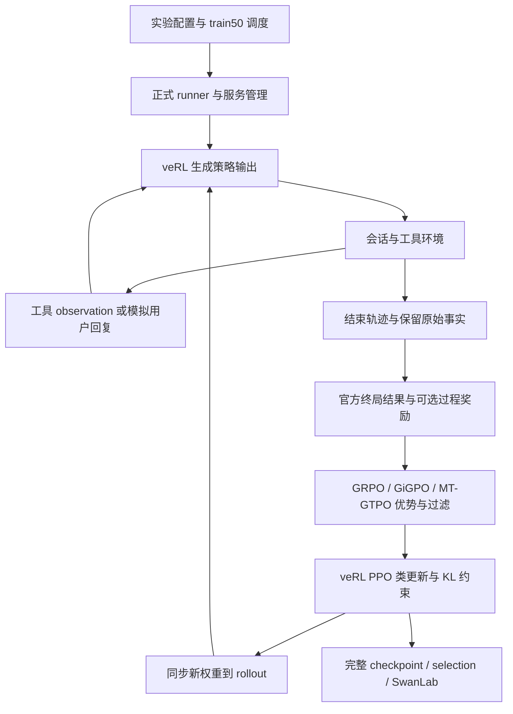

# Tau3 GRPO Fix：代码架构、SFT 数据、RL 难点与评测说明

> 核对时间：2026-09-21 15:21（北京时间）。本文依据当前本地源码、已保存的训练审计和评测报告编写；没有为写本文重新训练或评测。
>
> 本地仓库：`/Users/apple/Projects/program-llm/tau3_grpo_fix/code`。读取时 Git HEAD 为 `5abdb46138a6fa813838664b74143fb179e3af92`，工作区存在未提交修改，因此 HEAD 不能单独代表本文对应的全部实现。历史实验以各自配置、源码快照和模型身份为准。
>
> 特别区分三个状态：**已完成的历史实验、当前代码默认值、独立候选或进行中的实验**。它们不能混作一套结果。当天 A45/B100 对照的状态引用本地报告最后的 15:10 记录，没有重新查询远程实时进程。

## 1. 项目在做什么

项目让语言模型扮演航空客服，通过查询、订票、改签、取消、修改乘客、处理行李和补偿等工具完成多轮业务任务。模型需要遵守政策、理解用户约束、获得必要确认，并把数据库改成正确状态。

整个项目包含三种不同的学习或验证方式：

| 阶段 | 模型做什么 | 反馈来源 | 要回答的问题 |
| --- | --- | --- | --- |
| SFT | 模仿预先整理好的完整客服对话 | 示范中的 assistant 输出 token | 模型能否学会工具协议与基本业务流程？ |
| RL | 实时与模拟用户、工具环境交互，产生新轨迹 | 官方终局结果，以及可选过程奖励 | 哪些交互行为应当更常出现？ |
| 独立评测 | 冻结权重，在固定任务上重新完成任务 | 官方结果判定与失败诊断 | 模型在开发评测集上是否真正更可靠？ |

当前最主要的研究结论是：**工程链路已经能完成更新、保存、恢复和评测，但现有训练尚未展示可靠的成功率提升。过程奖励、优势归因、训练数据质量和评测语义仍有具体难点。**

`tau2-bench/` 是固定版本的环境实现目录，名称本身不能说明基准过时。项目另行固定 AReaL 训练/selection 数据与官方 τ³ final 数据的来源和版本。

## 2. 代码架构与职责边界

### 2.1 目录对应的责任

| 目录/模块 | 负责什么 | 关键入口或文件 |
| --- | --- | --- |
| `configs/` | 模型、硬件、数据、采样、奖励、算法和协议配置 | `train/rl/formal50_a800.yaml`、`protocols/formal50.yaml` |
| `scripts/` | 简短的启动、准备和维护入口 | `train/{sft,rl}/run.sh`、`eval/run.sh` |
| `tau3_grpo/configuration.py`、`launch.py` | 解析 YAML 包含链、组合配置、启动实际程序 | 通用配置驱动入口 |
| `tau3_grpo/data/` | 任务 manifest、SFT 整理、RL parquet、轨迹结构和泄漏检查 | `sft.py`、`prepare_sft.py`、`parquet_builder.py`、`trajectory.py` |
| `tau3_grpo/training/sft/` | SFT 数据渲染、监督 mask、训练和 LoRA 合并 | `dataset.py`、`trainer.py`、`train.py`、`merge.py` |
| `tau3_grpo/training/rl/` | 正式实验生命周期、预检、训练启动、checkpoint 管理 | `runner.py`、`train.py`、`checkpoints.py` |
| `tau3_grpo/training/services.py` | 管理本次运行拥有的模型服务与子进程 | 服务启动、退出与清理 |
| `tau3_grpo/envs/` | 任务会话、独立数据库、工具执行和模拟用户交互 | `session.py`、`tools.py`、`interaction.py`、`orchestrator.py` |
| `tau3_grpo/evaluation/` | 官方验证、过程奖励、独立评测和严格比较 | `verifier.py`、`process_reward.py`、`run.py`、`runtime.py`、`compare.py` |
| `tau3_grpo/algorithms/` | 优势计算、动态过滤、anchor 表示 | `tau_gigpo.py`、`mt_gtpo.py`、`dynamic_filtering.py`、`anchors/` |
| `tau3_grpo/integrations/` | 将项目算法、轨迹和记录接入 veRL | `verl/` 下 estimator 与 batch 适配 |
| `tau3_grpo/models/` | tokenizer、模板、模型兼容和 token 预算 | SFT 与候选 token harness 的输入处理 |
| `tau3_grpo/tracking/` | 指标、SwanLab、轨迹与运行记录 | 训练和评测证据留存 |
| `tau3_grpo/analysis/` | 已有轨迹重放、奖励校准和信用审计 | 不等同于正式训练算法 |
| `verl/` | 训练框架及登记过的项目补丁 | rollout、PPO 更新、分布式训练 |
| `tau2-bench/` | 业务政策、工具、数据库和官方 evaluator | 环境执行与终局判定 |
| `tests/`、`env_info/` | 回归、集成验证、vendor 补丁身份 | CPU/GPU 验证范围分别登记 |
| `data/`、`results/`、`checkpoints/` | 固定输入、实验产物、可恢复训练状态 | 不作为长期源码副本 |

`configs/` 保存“这次要跑什么”，`scripts/` 负责启动，Python 包保存可测试的实现。奖励判定、信用分配和参数更新各有归属，不把算法藏在 shell 脚本里。

### 2.2 一次 RL 更新如何流动



一般训练链路为：

```text
配置 / training.rl.runner
  → launch / scripts/train/rl/run_qwen35.sh
  → training.rl.train：注册项目 estimator
  → verl.trainer.main_ppo
  → agent loop ↔ envs.interaction / tools / session
  → verifier / process reward
  → integrations.verl ↔ algorithms
  → actor 更新、权重同步、保存与评测
```

正式单实验入口是 `python -m tau3_grpo.training.rl.runner`，支持 `grpo`、`tau_gigpo`、`mt_gtpo`。通用启动入口是 `python -m tau3_grpo.launch`。旧控制器和日期配置保留历史复现用途，不能仅凭旧文件中的训练步数决定新实验预算。

### 2.3 Harness 是什么

Harness 是组织一次完整 agent 交互的执行流程，包含：初始化会话、提供 prompt/schema、解析工具调用、执行动作、返回 observation、推进模拟用户、处理预算与终止、保存轨迹、调用验证器。

它不是 RL 算法，也不是奖励公式；在本项目中由 `envs/`、veRL agent loop 和独立评测 runtime 共同实现。

三类对象必须分清：

| 对象 | 能看到什么/承担什么 |
| --- | --- |
| 策略模型 | 系统政策、工具 schema、可见用户对话与工具返回；不能看到隐藏参考答案和奖励字段 |
| 用户模拟器 | 按任务中的用户场景与指示扮演用户；生成的后续回复会影响实际分支 |
| 环境/验证器 | 保存独立状态、执行工具，持有评分所需的任务与参考动作 |

每条轨迹使用独立可变数据库；模型执行环境与参考动作回放环境也必须隔离。多个工具调用按列表顺序完整执行，逐一返回对应 observation；一个调用报错不应使后续调用悄悄消失。

当前 prompt 采用 `airline_sequential_multicall_v1`：一轮可以发文本或一个/多个工具调用，不能同时回复用户和调用工具；依赖前一次结果的调用必须等到下一轮；每个写操作仍须满足用户确认要求。该协议是项目对原单调用约束的显式修改，记录为 `benchmark_policy_modified=true`，不能称完全未改的原始交互协议。

来源：[架构说明](architecture/layout.md)、[系统提示词实现](../tau3_grpo/prompts.py)、[开发与运行约定](../AGENTS.md)。

## 3. 数据分成哪些集合，为什么这样分

### 3.1 任务数据与示范数据是两条来源

| 数据 | 实际规模 | 用途 |
| --- | ---: | --- |
| AReaL Airline RL 任务池 | 1,148 个任务 | 提供用户场景、初始 DB、参考动作与评分条件 |
| 原始任务划分 | train200 / selection60 / reserve888 | 固定训练来源、开发评测与保留池 |
| 当前正式 RL 训练池 | train50，来自 train200 | 小预算受控算法比较 |
| AReaL Airline SFT 对话池 | 999 条完整对话 | 离线客服示范 |
| 历史 SFT 输入 | 45 条训练 / 5 条验证 | `new-off` 的监督学习起点 |
| 官方 τ³ Airline final | 50 个任务 | 模型和评测协议确定后的最终测试 |

SFT 的 45 条完整对话，不是 RL 的 50 个任务；SFT 的 5 条验证对话，也不是 selection60。SFT validation 测预测示范的 loss，selection 测闭环任务成功率。

AReaL 固定 revision 为 `86971dc03da6e7c1a7933295e05b84aab8215386`。任务初始划分按 seed42 与任务 ID/内容指纹做稳定 hash 排序，再取 200/60/888，减少随机库版本变化对划分的影响。

### 3.2 train50 的构造

train50 是经过筛查的课程池，不是从 1,148 题重新任意抽 50 题。构造保留原 40 个核心任务，再从原 train200 增加 10 个组合任务。

| 启发式主类 | 数量 |
| --- | ---: |
| 改签/改舱 | 10 |
| 取消/退款及相关拒绝 | 9 |
| 乘客变更 | 6 |
| 仅行李 | 2 |
| 仅新预订 | 3 |
| 多目标组合 | 20 |
| 合计 | 50 |

筛查核对任务和 DB hash、初始实体引用、评分字段，并在隔离 DB 中回放参考动作。原 train200 中，10 个因目标冲突或评分弱项暂缓，12 个因包含原 SFT 未展示的 `send_certificate` 暂缓。

新增 10 个任务用于组合训练：7 个完整业务工具集合未在所比较的 45 条示范中出现，3 个集合出现过但完整顺序/重复次数未出现。这只证明离散签名差异，不证明语义上全新；加入 RL 后，它们就是训练任务，不能再作为未见测试集。

这一设计降低早期训练难度、覆盖更多业务组合，但同时形成覆盖局限：例如当前 train50 的选择没有覆盖那些被暂缓的补偿任务。不能假设一个 50 题课程池代表全部 Airline 分布。

任务 ID 隔离、词面去重和 gold 可执行，均不等于充分语义去污染或所有业务规则已人工验证。多个任务复用同一初始 DB 模板也不自动意味着泄漏；关键是任务内容、划分与运行时状态隔离。

来源：[数据身份说明](../data/README.md)、[任务划分实现](../tau3_grpo/data/manifest.py)、[课程筛查说明](rl_curriculum_plan_20260912.md)。课程旧文中的 100-step 计划已被后续正式 20-step 预算替代，本文仅引用其任务构造。

## 4. SFT 数据具体怎样构造

### 4.1 从“逐轮记录”恢复“完整对话”

原始 SFT 文件包含 33,531 行，其中 Airline 为 12,842 行，对应 999 个不同的 `source_dialog_id`。每行是一个 assistant 轮及其前文，不是独立完整任务。

当前构建流程：

1. 只保留 Airline 来源行。
2. 按 `source_dialog_id` 分组，取 `turn_index` 最大的一行。
3. 读取该行的历史 `messages`，追加该行的 assistant `answer`，恢复完整对话。
4. 检查对话包含 system、用户轮，并以 assistant 输出结束。
5. 用项目统一政策与多调用协议替换源 system prompt。
6. 对完整对话做长度、近重复与意图多样性选择，最后按对话划分 train45 / validation5。

取最后一行是因为它已含之前的上下文。若直接抽取 50 个源行，会重复训练同一段前文，还可能把同一对话的不同轮拆入训练和验证，造成泄漏。

### 4.2 如何选出 45+5

构建器的默认选择顺序是：先排除与受保护任务意图过于相似的对话，再排除超长对话，然后按 seed 绑定的稳定 hash 排序，贪心选择不同意图。

| 规则 | 当前实现/保存值 | 目的与限制 |
| --- | --- | --- |
| 受保护意图 | sidecar 记录 110 个：selection60 + 官方 final50 的 reason 文本 | 构建时用于排除近重复；不把它们的答案放入示范 |
| 相似度 | 规范化英文后，取词集合 Jaccard 与 `SequenceMatcher` 比值的最大值 | 是词面启发式，不是语义模型 |
| 排除阈值 | 0.88 | 高于或等于阈值的候选不选 |
| 多样性 | 同样以 0.88 分桶，每桶最多 1 条 | 减少小样本被相似意图占满；代码中的 semantic 命名不代表语义认证 |
| 长度门槛 | 原 split 记录 16,384 token | 按构建时指定 tokenizer/template 和工具 schema 计数 |
| 排序 | seed、dialog ID、消息 hash 的稳定排序 | 可复现选择，不保证统计代表性 |
| 最终划分 | 前 45 条训练，后 5 条验证 | 完整对话之间互斥 |

999 条 SFT 对话的 `scenario_id` 为空，因此不能凭该字段建立 SFT 与 RL 任务的一一对应；当前主要依赖来源 ID、消息 hash 与 `reason_for_call` 审计。

官方 final50 的 reason 曾用于构建期近重复排除，这是已存在的数据接触边界，应透明记录；不能声称 final 的所有文字从未被开发流程读取。它的模型成绩仍不能用于反复调参。

构建 CLI 默认 tokenizer 名称仍是历史 Qwen2.5 配置。重建别的模型数据时必须显式选择对应 tokenizer；16,384 的构建门槛也不等于当前 4B 训练器的 24,576 上限。实际是否截断，应核对本次原生模板渲染结果，不能只看旧 sidecar。

### 4.3 监督哪些 token

一条 SFT 输入包含完整 system、用户消息、assistant 消息、工具调用和工具返回。训练目标只覆盖 assistant 生成的答案、工具调用和相应结束 token。

```text
system 政策 / tools schema  → 提供上下文，不作答案监督
user 请求                 → 提供上下文，不作答案监督
assistant 查询工具调用     → 监督
tool 返回                 → 提供上下文，不作答案监督
assistant 解释/确认/写调用  → 监督
padding                   → 不监督
```

非监督位置的 label 为 `-100`。模型依然能注意到用户和工具内容，只是不要求它把这些内容作为自己的答案生成。mask 根据原生模板/token 边界构造，Qwen3.5 使用专用模板处理；长度超过上限直接报错，不静默截断完整对话。

数据集还保存 `effective_train.jsonl` 等实际生效消息，便于区分“磁盘源输入”和“替换 system 后真正用于训练的内容”。

### 4.4 当前历史起点 `new-off` 的真实训练身份

`new-off` 是多调用协议下的 Qwen3.5-4B、non-thinking、LoRA SFT。它不是更早的 SFT-003，也不是当天新跑的 A45。

| 项目 | 已核对的历史值 |
| --- | --- |
| 数据 | 45 条训练、5 条验证 |
| LoRA | r16、alpha32、dropout0.05 |
| 学习率 / seed | `1e-4` / 42 |
| batch | micro-batch1，梯度累计8，有效 batch8 |
| 训练量 | 5 epoch，实际 30 次 optimizer update |
| 最佳 checkpoint | step30 |
| 验证 loss | 约 0.651187 → 0.422255 |
| 训练总 token / 监督 token | 485,330 / 96,660，每遍数据统计，不是五遍累计 |
| 验证总 token / 监督 token | 50,386 / 10,778 |
| 最长训练对话 | 16,255 token，核查无截断 |

LoRA 合并后的 `checkpoints/sft-merged/new-off` 是已有正式 RL 的共同起点；RL 采用全语言参数更新，不是延续 LoRA-only 的训练范围。

实际训练输入 SHA256：`e0aec9fb93c25f4f63e6580f6cdfcc0b95c1dfabe47bdf284745fa1759d1384b`。不能把旧审核快照 `a930dbff...` 当成同一文件；二者有 44 条共同且消息相同的对话。

### 4.5 当前 SFT 数据的已知不足

旧构建器**没有按源 `correct/reward` 标签过滤**，导出记录也未直接保留这两个质量标签。类注释中的“correct conversation”不能当作质量验证结论。

历史审核确认：45 条均带源 reward=1，但其中 4 条源 correct=0，即 `airline_dialog_837/357/669/172`；这些对话仍在实际 `new-off` 训练输入中。审核发现无依据的人工权限推测、时间摘要错误、资格判断过早、人物/行程混淆等内容问题。源标签定义并不充分清楚，不能将 correct=0 解释成整段业务全部失败。

旧示范的单调用 system 与实际多调用内容曾冲突；当前统一多调用 prompt 和执行链已经处理这项协议问题。**协议修复不自动纠正对话中的事实和政策错误。** 更严格的新 prompt 与原有示范内容是否完全一致，也需要逐例审查。

原始公开 SFT 的 999 条对话没有 `send_certificate` 调用，45 条暖启动还存在其他稀有工具覆盖不足。少量验证对话上的 loss 下降，只代表模仿目标更容易预测，不代表真实业务成功率提高。

来源：[构建器](../tau3_grpo/data/sft.py)、[准备入口](../tau3_grpo/data/prepare_sft.py)、[监督 mask](../tau3_grpo/training/sft/dataset.py)、[四条示范审计](sft4b_four_flagged_dialogues_20260911.md)、[实际训练身份审计](training_credit_chain_20260921.md)。

### 4.6 当天新增 A45/B100：单独的数据覆盖实验

本地最新报告记录了另一条正在推进的 SFT 对照，不能将其结果归入历史 `new-off`：

| 项目 | A45 | B100 |
| --- | --- | --- |
| 训练数据 | 原 45 条 | 原 45 条 + 52 条公开 SFT + 3 条编写并实跑工具的补充示范 |
| 验证数据 | 原 5 条，独立保留 | 同一 5 条 |
| 初始化 | 同一 Qwen3.5-4B 固定快照 | 同一快照 |
| 优化预算 | 30 次更新，评测最终 step30 | 同样 30 次更新 |
| 评测 | token_v4、selection60×4 | 同一协议和计划 |

新增公开候选要求源各轮 `correct=1/reward=1`，并检查参数 schema、调用与返回配对、近重复和原生模板长度；选择时优先补齐稀有工具，再补不同意图。保留原 45 条意味着它不是“所有历史质量问题已经清洗”的实验。

3 条补充示范来自原 AReaL RL **train 分区**的 `airline_618/444/1036`，不是 selection，也不应自动写成来自现有 train50。对话文字由编写得到，工具返回来自隔离 DB 的真实执行，最终 DB 与独立执行参考动作一致。它们不是教师模型在线采样的成功轨迹，数据库一致也不能认证每一句话都正确。

B100 覆盖 14 个工具；报告列出 `send_certificate` 3 条、`calculate` 2 条、`list_all_airports` 5 条、`search_onestop_flight` 5 条。新增覆盖不等于充分业务审核，源公开 SFT 也未完成全部独立任务重放与语义去污染。

截至本地报告 15:10：两组完成 30 次更新和合并；B 曾 OOM 后从同一基座重跑，旧记录保留。首次评测存在动态导入并发问题和 token 端点超时，后续修复与恢复的两组各 4 条 smoke 已完成，正式 480 条已启动，**尚无本文可引用的完整成功率结论**。两组验证 loss 为 0.42261523/0.41305286，不当作任务成绩。

该实验比较数据扩充与覆盖方案整体；相同更新数不等于相同监督 token 数或每条示范曝光次数。它也没有检验后续 RL 收益。

来源：[A45/B100 状态与范围](sft_coldstart_ab_20260921.md)、[扩充选择实现](../tau3_grpo/data/sft_expansion.py)、[补充示范实现](../tau3_grpo/data/sft_demonstrations.py)。

## 5. RL 如何与 benchmark 交互

### 5.1 RL 的输入不是现成正确答案

RL parquet 一行表示一个任务。策略的初始 prompt 是系统政策和固定首条用户消息；任务记录、DB 路径、hash、会话参数等放在环境侧的 `extra_info/interaction_kwargs`。

`record_json` 供环境恢复任务和验证条件使用，不作为策略可见 prompt。这里 `reward_model.ground_truth` 保存任务 hash，不能理解成向模型发送参考动作。构建器拒绝官方 final 条目进入这条训练数据路径。

每次 rollout 都是重新执行：策略发出动作，环境改变状态，模拟用户继续回应，直到正常结束或预算终止。Benchmark 提供状态与评分，veRL 执行梯度更新，两者职责分开。

### 5.2 当前正式训练约定

| 设置 | 当前正式配置/约定 |
| --- | --- |
| 共同起点 | Qwen3.5-4B `new-off`，non-thinking |
| 更新范围 | 全语言参数 RL |
| 数据 / seed | train50 / 42 |
| 每个外层 step | 8 个任务组 × 每组 8 条完整轨迹 = 64 条候选 |
| 总预算 | 20 外层 step = 1,280 条候选轨迹 |
| 学习率 / KL | `1e-6` / `0.01` |
| 默认当前温度 | policy 与 user 为 0.7；历史运行以保存配置为准 |
| 常规训练预算 | prompt 8,192；累计 response 16,384；model context 24,576；每次 policy 输出 1,024 |
| 交互限制 | assistant/user 各 15 轮配置，工具可见返回字符上限 65,536 |
| 定期评测 | 每 10 step，selection60，每任务 4 次 |
| 保存 | 每 10 step 保存完整续训 checkpoint；验证新节点后保留最新 1 份 |
| 记录 | SwanLab 每步数值指标，配置、源码、轨迹与评测产物本地留档 |

50 是不同训练任务数，不应再次乘进 `20×8×8` 的候选轨迹预算。外层 step 与内部 optimizer update 次数也不等同。过滤可能改变有效训练量，所以还要记录保留组数与有效 token，不能只比较总 step。

历史 GRPO/MT 模型使用当时保存的温度等条件；当前默认改为 0.7，不会改写已有权重的训练历史。旧模型统一重评可比较冻结模型表现，但不自动构成当前新训练配置的严格算法消融。

### 5.3 三类算法到底不同在哪里

| 算法 | 主要信号 | 信用分配方式 | 关键边界 |
| --- | --- | --- | --- |
| GRPO | 官方终局 0/1 | 同任务组归一化，整条轨迹共享终局优势 | 无法精确定位哪次操作导致失败 |
| GiGPO / `tau_gigpo` | episode 信号 + 基于状态 anchor 的 step 信号 | 将可比状态下的步骤分组比较 | anchor 是否等价、是否有足够重复状态很关键 |
| MT-GTPO | 显式版本的过程奖励 + 终局结果 | 折扣回报按任务/轮位置归一化，再加 episode 项 | 同轮多个调用共享优势，未来信用可能影响错误轮 |

GiGPO 的 anchor 是“步骤在什么状态下发生”的表示。数据库相同不保证决策条件相同：用户批准、当前提案、已读到的信息都可能不同。默认/历史 anchor v1 与后续 v2–v4 研究候选需要分别记录，不能把语义槽候选当成已经验证有效的线上分组器。

动态过滤 DF 是独立开关：屏蔽没有有效学习信号的组，本项目固定候选预算、过滤后不补采样。MT 应检查联合优势，不能因为终局全相同就丢弃仍有过程差异的组。已有 DF 工程验收运行剔除了 0 组，只说明路径能工作，不证明过滤有效果收益。

### 5.4 一条轨迹需要保留什么

除了自然语言消息，还需要任务/组身份、模型与配置身份、实际生成 token、轮级 token span、response mask、工具参数/返回/错误、终止原因、官方是否评分、奖励明细，以及优势/过滤的可复算输入。

工具和用户 observation 是上下文，不应被误作策略生成 token 更新。当前 MT 历史 buffer 支持精确轮级回放；旧 GRPO 只支持本次审计范围内的标量优势与日志核对，不能声称两者都能精确重现历史 optimizer 更新。

来源：[正式 profile](../configs/train/rl/formal50_a800.yaml)、[训练协议](../configs/protocols/formal50.yaml)、[parquet 构造](../tau3_grpo/data/parquet_builder.py)、[MT 实现](../tau3_grpo/algorithms/mt_gtpo.py)、[GiGPO 实现](../tau3_grpo/algorithms/tau_gigpo.py)。

## 6. 评测到底怎么做

### 6.1 三种验证不能混在一起

| 类型 | 数据 | 输出含义 |
| --- | --- | --- |
| SFT validation | 5 条固定示范 | teacher-forcing loss，衡量预测示范能力 |
| RL 训练内 selection | 固定 selection60×4，按节点运行 | 训练过程中选点与诊断，须记录训练内 harness |
| 独立推理 selection | 冻结权重重新启动推理和交互 | 比较完整 agent 系统的成功率 |
| 官方 final | 独立官方 final50 | 模型和协议确定后的最终报告，不反复调参 |

相同任务集不代表相同执行条件。训练内评测与独立推理可能在开场、工具输入、token 历史、轮数/上下文预算与采样温度上不同，因此成绩分别记录。

### 6.2 一条任务如何获得分数

评测加载固定任务和初始 DB，让策略与模拟用户交互，保存实际工具调用；正常结束后，由官方 evaluator 按任务 `reward_basis` 检查结果。

对于本轮主要的 DB 条件，验证器在隔离参考环境执行 gold 动作，再比较模型最终 DB 与目标 DB 的 hash。任务还可能有 ACTION、COMMUNICATE 或其他断言，不应把 DB 比较推广成所有域、所有任务的唯一规则。

本轮 440 条官方评分失败均为 DB=0、COMMUNICATE=1；这些任务没有额外 communicate 断言，后者不能说明每句业务解释都正确。工具返回成功、用户说满意、官方 DB 成功，是三个不同层面的事实。

预算终止保留原始轨迹与原因，按评测约定计 0；“未获官方评分”不等于“官方确认业务失败”。程序异常另存证据和堆栈，不删除后只报告成功样本。本轮四模型没有执行异常，但未来运行出现异常时必须披露完成度，不能冒称完整通过。

### 6.3 当前存在的 harness 版本

| 版本全名 | 主要行为 | 当前定位 |
| --- | --- | --- |
| `tau3_eval_legacy_v1` | 原生 Orchestrator 计步/错误上限、原开场、raw 工具返回；现含完成 STOP 优先修订 | CLI 默认；最近完成的四模型统一评测使用它 |
| `tau3_eval_train_control_v2` | 固定 15 轮/观察控制、无独立累计工具错误上限、观察字符投影 | 对齐部分训练控制，不代表全部 token 一致 |
| `tau3_eval_train_inputs_v3` | v2 加固定首条用户输入、显式 non-thinking、单次输出限制 | AReaL selection 输入候选 |
| `tau3_eval_token_v4` | 共享原生 ToolAgentLoop、传原始 token ID、追加 token 历史、显式预算和完整 schema | 当天 A45/B100 已有恢复后的真实 smoke，正式比较尚待完成；不自动成为全局默认 |

v3/v4 当前只支持 AReaL selection，代码在加载任务前拒绝用于官方 final。token_v4 也不意味着旧训练、旧评测自动与它等价。其源码元数据中仍有 live-service-pending 字样；当天报告新增的真实 smoke 证据应单独引用，不能扩大成全部服务/模型都已验收。

工具 schema、奖励版本、anchor 版本与 harness 版本各自独立。“采用 v4”信息不足，实验必须分别记录这些组件。

### 6.4 指标怎么解释

每任务运行 4 次，记成功数为 `c`：

- **pass@1**：各任务 `c/4` 的平均；四次齐全时也等于总成功条数除以 240。
- **pass@4**：本轮四次至少成功一次的任务比例，关注可成功覆盖。
- **pass^4**：四次全部成功的任务比例，关注稳定性。
- 若报告 k=2 等中间值，需要按采样组合估计，不把同一题的四次当四个独立任务。

两模型差值按任务配对 bootstrap 10,000 次，每题四次保持同组，报告 95% 区间。相同 seed 不保证不同模型经历相同用户对话；这种配对不是固定对话反事实实验，区间也不覆盖多个训练 seed 的差异。

### 6.5 最近完成的四模型结果

统一条件：legacy_v1 + 完成 STOP 优先；policy/user 温度均 0.7；30 Orchestrator step、10 工具错误；raw 返回；不强制单次 1,024 token；策略/用户上下文上限 24,576/16,384；trial seed42–45。Orchestrator step 不是 assistant 轮，不能把 30 step 直接理解成 30 次策略回复。

| 模型 | 成功/240 | pass@1 | pass@4 | pass^4 | 官方失败 | 预算终止 |
| --- | ---: | ---: | ---: | ---: | ---: | ---: |
| Base | 120 | 50.00% | 70.00% | 30.00% | 95 | 25 |
| SFT new-off | 108 | 45.00% | 71.67% | 16.67% | 107 | 25 |
| GRPO E0 step20 | 99 | 41.25% | 68.33% | 21.67% | 115 | 26 |
| MT reference_write/v3、DF off、step20 | 95 | 39.58% | 65.00% | 16.67% | 123 | 22 |

| 差值 | 百分点 | 任务配对 95% CI |
| --- | ---: | --- |
| SFT − Base | −5.00 | [−13.33, +2.92] |
| GRPO − SFT | −3.75 | [−11.25, +3.33] |
| MT − GRPO | −1.67 | [−8.33, +5.00] |

本轮没有看到净提点，所有上述区间跨 0，不能宣布稳定退化。该次比较没有 GiGPO，不提供三算法完整排名。历史其他温度/协议的成绩不能直接接入本表。

960 条正式轨迹与 16 条预检分开保留，正式执行异常为 0。后续 CPU 全量重放核对 6,430 次工具返回一致，862 条官方评分结果复现；98 条预算轨迹只诊断终态，未偷偷改判。其中 17 条在预算结束时 DB 已达标，说明收尾效率仍有空间，但它不足以解释所有失分。

来源：[评测协议实现](../tau3_grpo/evaluation/harness.py)、[官方 DB 判定](../tau2-bench/src/tau2/evaluator/evaluator_env.py)、[四模型完整报告](../results/analysis/grpo_improvement_evidence_20260920/execution-stop-fixed-20260920/final-analysis/report.md)。

## 7. 当前 RL 遇到的具体难点

### 7.1 业务正确性与 API 成功不同

已复核案例包括：未查询支付资料就把内部 ID 当成指定银行卡；航班正确但舱位错误；正确取消后又额外补偿；缺少资格前提却发放补偿。

GRPO 相对 SFT 补回 27 条失败，同时丢掉 36 条成功；MT 相对 GRPO 补回 29 条，同时丢掉 33 条。存在局部收益，但新增失败抵消了收益。MT 预算终止更少，正常结束的业务失败更多，因此延长上下文/轮数不是目前最有证据支持的首要改动。

### 7.2 参考目标、模拟用户与实际业务可能分歧

模拟用户可能明确要求换卡、改名，而固定参考 DB 不包含该变化；模型可能提出另一合法分支并得到用户接受；严格数组顺序也可能造成失败。本轮确认 6 条只有乘客顺序不同的失败。

必须区分真实业务错误、合法替代、模拟用户偏离、参考表示差异和预算结束。不能将“非参考写入”一律处罚，也不能悄悄修改官方分数。现有定向案例不能估计全部歧义比例。

### 7.3 GRPO 终局信号稀疏且粗粒度

实际 E0 的 160 个 8轨迹组中，48 组全失败、15 组全成功，合计 63/160=39.38% 没有终局组内差异。对应 504 条终局优势为 0；KL 项仍可能参与更新。

标量回放显示：396 条正优势全部成功，380 条负优势全部失败，与 20 步在线统计一致，没有发现失败被错误计算为正终局优势的反号故障。但整条失败时，正确查询与错误付款一起受负信号；成功时，多余动作也可能跟着得到正信号。

### 7.4 MT 奖励只覆盖部分进展，未充分表达最终保持正确

实际训练版本 `reference_write/v3`：首次匹配参考 DB 写入分得总计最多 +1 的正工具奖励，明确执行错误一般 −0.1，查询和其他非报错写入通常中性。v3 按环境实际参数语义匹配，仍不等于通用业务正确性判断器。

“做对参考动作后，又执行额外写入破坏结果”不会自动撤销先前过程分，更多依赖终局失败体现。25 条官方失败轨迹拿满正工具奖励额度，但它们的 245 轮中 208 轮最终优势为负；其中 12 个中性非参考写入轮只有 3 个为正。不能从正奖励直接推断整条失败被强化。

### 7.5 MT 同轮多调用共享优势

当前递推为 `G[k] = r[k] + 0.9 × G[k+1]`，终局结果放在虚拟结束轮；回报按任务 UID 与轮位置归一化，再加 `0.3 × episode advantage`。当前 MT 使用总体标准差；GRPO 审计采用其实际框架的样本标准差，两者重算不能混用。

实际 `airline_981` 一轮中，错误订票 −0.1 与两次正确取消各 +1/3 相加，整轮最终优势 +1.880022。代码将同一优势赋给这一轮全部生成 token，因此错误调用和正确调用共享正信号。

这不是漏执行错误检查，而是分配粒度不足：当前能区分轮，不能在同轮内精确区分调用。

### 7.6 相对未来信用可能奖励“比别人少坏”，而非自己的进展

实际 `airline_1075` 的错误订票轮即时 −0.1，自身后续没有正奖励写入，最终失败，但同组其他轨迹未来回报更差，归一化后的未来贡献使它最终优势为 +1.670726。

完整 1,280 条 MT 训练轨迹、12,591 轮可复现原奖励、优势和 mask。共 1,368 个含工具错误的轮，其中 381 个优势为正：75 来自成功轨迹、59 来自官方失败、247 来自预算轨迹。错误后恢复应与未恢复错误区分，预算也不应冒充官方失败。

此外，同任务的相同轮序号不保证相同业务状态；后期还有组支持不足的问题。正优势仅是 PPO 输入，实际更新还受比率、裁剪、KL 和其他样本影响，尚无逐动作更新前后概率来证明某错误已被实际强化。

### 7.7 最新离线对照：简单去掉未来奖励仍有代价

固定原 buffer、奖励和分组，只去掉后续过程奖励、保留当前轮与折扣终局信号，再重新归一化，结果如下。下表单位是轮，类别可重叠。

| 切片 | 原算法正优势轮 | 时间候选正优势轮 |
| --- | ---: | ---: |
| 全部工具错误轮 | 381 | 68 |
| 官方失败中的工具错误轮 | 59 | 8 |
| 成功轨迹中干净的正奖励写入轮 | 502 | 503 |
| 成功轨迹中错误后首次正奖励写入轮 | 49 | 49 |

代价是成功轨迹中 242 个无即时奖励轮失去正信号，可能伤害查询、确认等前置行为。混合调用的错误订票案例反而从 +1.88 增加到 +2.39，说明时间信用和调用粒度是两个不同问题。

另一项调用事件诊断扣掉同轮其他调用的即时奖励，虽然能区分上述个例，却使全量 118 次正奖励调用失去正优势，其中 32 次来自成功轨迹，也不能直接作为训练公式。

历史只有精确轮级 token span，没有可认证的调用级 span；不能重新分词后假装获得原始生成边界。下一步需要真实记录调用边界，再设计调用局部反馈与非调用文本/前置行为长程反馈的组合。当前生产算法尚未因此改变，也没有新 pass@1 结果。

### 7.8 SFT 起点质量、覆盖和泛化未获保证

SFT 实际输入、监督渲染与截断核对未见异常，但小样本、已知内容瑕疵和工具覆盖不足仍存在。Base 至少成功一次的任务 42/60，SFT 43/60；四次全成功从 18/60 降到 10/60，更像本轮稳定性受损。

不能据此证明过拟合、遗忘或某四条示范是主因。当天 A45/B100 正在独立检验覆盖扩充，也不能在成绩完成前宣布改善，更不能直接推断能改善 RL。

### 7.9 工具输入与协议仍需按版本控制

旧 `verl_legacy_v1` schema 经 veRL 简化模型序列化后，会丢失嵌套 `$defs`、数组 `items` 等字段，模型缺少完整 Passenger/Payment 说明，执行器却仍严格验证。这是已确认的模型可见输入缺陷。

`tau3_full_schema_v2` 已有保留完整 schema 的实现，基础配置仍默认 legacy；token_v4 使用完整 schema。不能因为候选存在，就认为历史训练模型已经修复这项输入问题，也不能把所有支付错误都归因于它。

训练与独立评测不必所有设置完全相同，但各模型比较要使用同一明确协议。切换 schema、harness、温度和奖励若同时发生，难以归因提升来自何处。

### 7.10 新奖励 v4 与 GiGPO 候选仍有各自证据缺口

`paper_env_split_v4` 是另一奖励系列，分离参考读/写等类别，并将成功转人工归中性。它不是 `reference_write/v3` 的已训练后继模型，也未改变 MT 混合优势公式。

最新新 SFT 采样校准采用 15 个完整组、120 条轨迹；state_change 拟合支持仅 8，低于 20，留出 24 条中记录成功只有 1 条；26 条未获官方评分而使用训练回退 0。候选未通过、未导出冻结配方，不能用全量平均负错误优势宣称信用问题已解决。

GiGPO 的状态等价、分组支持、语义候选错误合并，以及 DF 的实际有效性，需要独立实验；本轮四模型分析没有给出 GiGPO 新成绩。多个组件编号相同并不代表同一套升级。

来源：[业务 badcase](selection_badcase_analysis_20260921.md)、[MT/SFT/GRPO 信号审计](training_credit_chain_20260921.md)、[固定 buffer 对照](mt_credit_comparison_20260921.md)、[工具输入审计](architecture/harness_inputs_20260920.md)、[v4 新数据校准](mt_gtpo_v4_fresh_calibration_20260921.md)。

## 8. 已经解决什么，下一步应该验证什么

| 类别 | 已有结论 | 尚不能推出的结论 |
| --- | --- | --- |
| 架构与接口 | 主体分层、真实更新、保存恢复、导出加载及部分接口验收已有证据 | 所有新候选协议都已验收或有效 |
| 多调用/隔离/STOP | 已有修复与回归；当前四模型评测包含 STOP 优先修订 | 历史错误运行的旧分数因此自动变有效 |
| 奖励/优势计算 | MT 原始 payload 精确回放；GRPO 标量及日志一致 | 算法设计已经适合每种局部行为 |
| 模型效果 | 本轮没有净提点，差值区间跨 0 | 已证明 RL 必然有害或 MT 数学实现错误 |
| 离线信用候选 | 可减少部分错误正信号，也暴露前置信号损失 | 已证明训练后成功率提高 |
| SFT 扩充 | 构造与训练已有新记录，正式评测在该报告时点进行中 | B100 已优于 A45 或后续 RL 更好 |

建议把后续工作分成可归因的实验，而不是继续无边界扩大架构：

1. **输入与数据**：明确本轮采用的 schema；修订已证实的示范内容问题；等待 A45/B100 同协议完整结果，并保留 Base 对照。
2. **信用分配**：先记录真实调用边界，固定奖励研究局部与长程信用，同时检查错误抑制、必要查询、确认、恢复与合法替代。
3. **可比训练**：沿用同一初始化、任务调度、候选预算、采样/评测条件；每次只改一个主要因素，记录过滤后有效量。
4. **效果证据**：报告官方成功率、任务配对区间、业务错误与预算切片；有可信信号后再扩大预算、多 seed，并在模型/协议确定后使用 final。

CPU 数值正确、工程 smoke 通过、真实训练发生更新、独立评测提点，是四个不同验收层次。完整训练 checkpoint 还必须包含优化器、调度器、随机与数据进度等恢复状态；只有推理权重不算可精确续训。

## 9. 阅读入口与证据索引

| 想了解什么 | 建议先读 |
| --- | --- |
| 当前代码架构 | [layout](architecture/layout.md)、[工程完成边界](architecture/remaining_work_20260919.md) |
| 当前配置与实验索引 | [CURRENT_EXPERIMENT](CURRENT_EXPERIMENT.md)、[EXPERIMENTS](../EXPERIMENTS.md)、[catalog](../configs/experiments/catalog.yaml) |
| 数据身份与 train50 | [data README](../data/README.md)、[实际 train50 manifest](../results/analysis/rl_curriculum50_20260912/manifests/areal_airline_train_seed42.jsonl) |
| 历史 SFT 实际输入 | [train45](../data/sft/airline_sft_train_seed42.jsonl)、[validation5](../data/sft/airline_sft_validation_seed42.jsonl)、[split sidecar](../data/sft/airline_sft_split_seed42.json) |
| SFT 新覆盖实验 | [A45/B100](sft_coldstart_ab_20260921.md) |
| 四模型成绩与全部轨迹入口 | [完整评测报告](../results/analysis/grpo_improvement_evidence_20260920/execution-stop-fixed-20260920/final-analysis/report.md) |
| 业务失败原因 | [badcase 分析](selection_badcase_analysis_20260921.md) |
| 奖励→优势及 SFT/GRPO 核对 | [训练信号链审计](training_credit_chain_20260921.md) |
| 最新离线对照与副作用 | [MT 信用对照](mt_credit_comparison_20260921.md) |
| 历史问题与影响 | [ERRORS](../ERRORS.md) |

本文是上述源码与证据的解释性快照；它不替代各 run 的实际生效配置、原始轨迹、代码 hash 和模型身份。文中链接使用相对路径，随整个仓库移动时仍可阅读。
