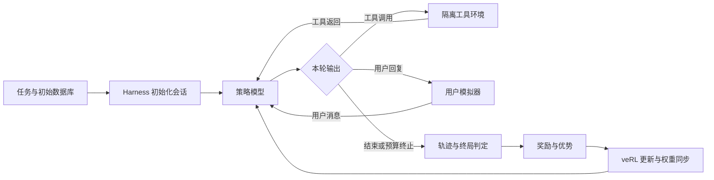

# 多轮工具调用 Agent 的训练与强化学习信用分配研究

> 用途：项目介绍、技术交流与面试讲解。正文按“任务为什么难 → 系统怎样搭建 → 数据怎样构造 → 算法如何学习 → 怎样验证 → 发现了什么”展开。文末提供追问清单和证据入口。
>
> 本文采用截至 2026-09-21 已有证据：四模型统一评测、训练信号审计与固定轨迹离线对照。后续 SFT 扩充实验只作为研究方向介绍，不预写效果。

## 一、项目名称与一句话定位

**项目名称：多轮工具调用 Agent 的训练与强化学习信用分配研究。**

**一句话介绍：基于 AReaL Airline 任务与固定版本的 τ 系列业务环境，搭建从完整对话 SFT、在线交互 RL 到独立评测的训练链路，比较 GRPO、GiGPO 与 MT-GTPO 的学习信号，研究终局奖励和过程反馈如何准确作用于多轮工具调用。**

技术栈：Python、PyTorch、Transformers/PEFT、Qwen3.5-4B、LoRA、veRL、vLLM、GRPO/GiGPO/MT-GTPO、τ 系列环境、SwanLab。

项目的主要工作有三部分：构造可追溯的数据与任务划分，建立能保存和重放训练信号的 agent 训练系统，再通过受控评测与信用审计定位未提点的原因。算法建立在已有方法上，项目工作体现在环境适配、协议处理、奖励实现、训练接线和实验诊断。

## 二、两分钟介绍

这个项目研究的是多轮工具调用 Agent 如何通过强化学习把业务任务办得更可靠。场景是航空客服：用户可能同时要求改签、调整行李和退款，模型需要查询信息、理解政策、获得确认，再调用工具修改数据库。

我把项目组织成数据、交互环境、训练和评测四部分。数据侧，从公开 SFT 的逐轮记录恢复完整对话，构造 45 条训练、5 条验证的冷启动数据；RL 侧从固定训练分区中筛选 50 个业务任务。交互侧由策略模型、独立用户模拟器和数据库工具环境组成，每条轨迹的状态相互隔离。

训练先用 Qwen3.5-4B 做 LoRA SFT，再接全语言参数 RL。GRPO 根据同任务多条轨迹的终局结果学习，GiGPO研究相似状态下的步骤比较，MT-GTPO结合过程奖励做逐轮信用分配。

项目最有代表性的发现是，过程奖励更细，并不意味着训练反馈一定更准确。审计中发现，一轮里错误订票和正确取消共享正优势；也有最终失败的错误轮，因为其他轨迹后续更差而得到正优势。

为定位原因，我基于 1,280 条训练轨迹做固定奖励的离线对照。去掉后续过程奖励后，正优势错误轮从 381 降到 68，但成功轨迹中 242 个无即时奖励轮也失去正信号，说明必要的查询、确认与局部错误必须分别处理。目前统一评测还没有证明 RL 稳定提点，项目下一步聚焦调用级局部信用与长程任务信用的组合。

## 三、先用一个业务任务讲清问题

可以用下面这个概括性场景解释任务，具体金额与航班不对应某一条实验记录：

> 用户希望把返程改到更早的航班，保留现有舱位，再增加两件行李，并把差额退到指定银行卡。

完成它至少需要确认订单与用户身份、查询可用航班、理解舱位与行李政策、核对银行卡映射、解释费用、获得批准，再按依赖顺序执行写操作。

这个例子呈现了三个难点：

1. **信息逐步出现。** 下一步动作依赖前面的查询和用户回复，不能一次性生成整套答案。
2. **正确性是组合的。** 航班选对但付款卡选错，或者行李数量正确但收费规则错误，任务仍可能失败。
3. **局部成功可以被后续动作破坏。** 已经完成改签之后，多做一次不该做的补偿或修改，会使最终数据库偏离目标。

因此，系统需要同时回答两个问题：最终任务有没有完成，以及哪些动作对这个结果有贡献。前者决定评测，后者决定训练反馈。

## 四、怎样把业务任务变成可训练的 Agent 系统

### 4.1 模型、模拟用户与环境分别负责什么

策略模型使用 Qwen3.5-4B，负责理解可见对话并生成回复或工具调用。历史正式实验使用独立的 Qwen3.8-27B-AWQ-INT4 用户模拟器，根据任务场景继续与策略交互。工具环境保存订单、航班、支付等状态，并实际执行查询和修改。

选择 4B 级策略的工程考虑，是在有限预算下支持多条长轨迹采样与全参数更新，便于进行受控对照。更大的用户模拟器承担用户角色。这些是部署与实验设计取舍，并非证明这些模型在该场景中最优。

**模型负责决策，harness 负责让决策真正进入环境。** Harness 管理任务初始化、消息和工具 schema、调用解析、顺序执行、工具返回、用户模拟、终止判断与轨迹记录。



### 4.2 架构怎样支持实验

代码按五层组织：

| 层 | 作用 | 对应实现 |
| --- | --- | --- |
| 数据与配置 | 固定任务、示范、实验条件和来源 | `data/`、`configs/` |
| 执行环境 | 组织多轮会话、工具和独立 DB | `tau3_grpo/envs/` 与 agent loop |
| 结果与奖励 | 官方终局验证、可选过程奖励、评测 | `tau3_grpo/evaluation/` |
| 学习算法 | 分组、优势计算与动态过滤 | `tau3_grpo/algorithms/` |
| 训练与记录 | 框架适配、更新、恢复、权重同步和实验跟踪 | `integrations/`、`training/`、`tracking/`、veRL |

这样的划分让环境执行、奖励定义和优势算法可以分别验证。例如研究 MT 信用分配时，可以固定已经保存的轨迹与奖励，仅替换优势计算，而不用重新采样整批对话。

### 4.3 三个直接影响结果可信度的工程设计

**数据库隔离。** 每条轨迹使用独立可变状态，模型执行与参考答案回放也使用不同副本。否则模型改过的 DB 可能污染参考环境，产生错误的成功判定。

**多调用协议。** 一轮可以包含多个工具调用，按列表顺序全部执行并返回结果；依赖前一个结果的动作要等到下一轮。每个写操作仍要满足确认要求。这是对原单调用约束的显式调整，SFT、训练与评测都需要记录采用的协议。

**终止与预算分开。** 正常完成的 STOP 不能在同一步被预算检查覆盖。正常结束、上下文超限、轮数超限、基础设施异常分别留档，避免把控制流问题误解为模型能力问题。

这部分工作的价值，是让后面的算法对照建立在可信的执行记录上。

## 五、SFT 数据怎样构造，为什么要这样做

### 5.1 任务与轨迹的区别

一个 RL 任务定义“要解决什么”：用户场景、初始数据库、工具、政策和评分条件。一条 SFT 轨迹展示“怎样解决”：完整用户对话、assistant 回复、工具调用与返回。

本项目 SFT 使用公开 AReaL 对话，不是从这 50 个 RL 任务的参考动作直接生成答案，也没有把当前流程做成“策略自行采样后只保留成功轨迹”的拒绝采样 SFT。

### 5.2 从逐轮数据恢复完整对话

公开 SFT 中，Airline 有 12,842 条逐轮记录，对应 999 段完整对话。每行包含当前 assistant 答案和之前的上下文。

处理时按 `source_dialog_id` 分组，取最大 `turn_index` 的记录，将历史 `messages` 与当前 `answer` 合并，得到完整对话。随后检查角色结构、替换统一政策与工具协议，再按完整对话筛选和划分。

按对话处理有两个原因：保留查询、确认、写入之间的依赖；防止同一段对话的不同轮进入训练和验证两侧。

### 5.3 45+5 是怎样选出来的

构建器以 `reason_for_call` 做词面近重复检查，排除与受保护任务过于相似的候选；按原生模板统计长度；使用 seed42 绑定的稳定 hash 排序，再用意图桶限制相似对话重复占位。最终选出 45 条训练、5 条验证。

相似度取词集合 Jaccard 与 `SequenceMatcher` 比值的较大者，阈值为 0.88，同意图桶最多保留一条。它是便于审计的词面启发式，不能保证所有语义重复都被排除。构建期受保护文本包含 selection60 和 final50 的 reason，用于排除近重复；参考答案没有因此进入策略输入。

45+5 是小预算冷启动设置，不是经过证明的最优数据规模。它便于先打通长对话监督和工具协议，也带来覆盖有限、验证集过小的问题。

### 5.4 SFT 具体学什么

完整对话都进入上下文，但只有 assistant 答案、工具调用和相应结束 token 计算监督 loss。system、user、tool observation 和 padding 的 label 为 `-100`。

例如工具返回给出银行卡列表，模型可以读到这些信息，但训练目标是让它正确生成后续查询、解释和支付参数，而不是模仿环境输出银行卡列表。

原 `new-off` 使用 Qwen3.5-4B non-thinking、LoRA r16/alpha32、学习率 `1e-4`，有效 batch8，5 epoch、30 次更新。LoRA 合并后作为已有 RL 共同起点；后续 RL 更新全语言参数。

实际渲染核对得到 485,330 个训练上下文 token、96,660 个监督 token，最长对话 16,255 token，无截断。验证 loss 从约 0.651 降到 0.422，但这只证明示范预测改善，不能直接说明任务成功率提高。

### 5.5 数据质量怎样影响研究方向

历史构建器没有按 `correct/reward` 标签过滤；45 条中存在 4 条已知内容瑕疵示范，包括政策前提表达过早、事实摘要错误和无依据权限推测。统一多调用协议解决了协议矛盾，内容问题仍需独立处理。

此外，999 条公开 SFT 没有 `send_certificate` 调用。后续 A45/B100 对照保留原45条，增加52条公开示范和3条基于训练分区任务编写并实跑工具的补充示范，检验覆盖扩充是否改善冷启动。补充示范的工具返回来自真实隔离执行，最终 DB 与参考一致，但不等于教师模型在线采样成功。

这个设计检验“数据扩充与工具覆盖方案”的整体作用，不能把差异全部归因于数量；保留原45条也意味着它没有同时完成全部内容清洗。该对照的效果需要单独报告，不能提前用来解释已有 RL 分数。

## 六、RL 任务与训练预算怎样设计

原始 Airline 任务池有 1,148 题，固定划分为 train200、selection60、reserve888。当前 train50 全部来自 train200：保留40个核心任务，增加10个多目标组合任务。训练与评测 ID 隔离，原始数据库模板可以复用，但运行时状态必须隔离。

筛选重点是任务结构、目标与参考动作、工具覆盖，以及参考动作在隔离 DB 上是否可执行。暂缓明显目标冲突或评分薄弱任务，也暂缓原示范尚未覆盖的部分工具任务。

新增组合任务让模型面对已见工具的新组合与顺序，关注跨步骤业务依赖。它们进入训练以后，就不能再称为未见测试；工具签名不同也不等于已经证明语义全新。

正式比较采用：

| 参数 | 设置 |
| --- | --- |
| 共同起点 | Qwen3.5-4B SFT `new-off` |
| 任务池 | 固定 train50 |
| 每次外层 step | 8 个任务组，每组 8 条轨迹 |
| 候选预算 | 20 step，共 1,280 条轨迹 |
| 学习率 / KL 系数 | `1e-6` / `0.01` |
| 节点评测 | 每10 step，selection60×4 |
| 记录 | 分组、轨迹、终止、奖励、优势及有效训练量 |

一组是同一个采样任务对应的8条轨迹，不是8个不同任务。多条采样提供同任务内部的结果差异，让算法构造相对反馈。

候选轨迹数统一后，还要报告 token 数、过滤后有效组、更新次数和计算成本。相同外层 step 不自动等于相同有效梯度或 GPU 时间。

## 七、为什么比较 GRPO、GiGPO 和 MT-GTPO

这三种方法提供了逐步细化信用分配的不同思路。项目将它们接入同一训练与环境链路，关注它们实际产生了什么信号。

### 7.1 GRPO：先建立可解释的终局奖励基线

GRPO 对同任务的多条轨迹计算相对优势，当前基线可概括为：

```text
轨迹优势 =（该轨迹终局奖励 − 同组平均奖励）/（同组标准差 + ε）
```

它不需要单独训练 value model；更成功的轨迹获得正优势，更差的获得负优势，生成 token 共享轨迹级信号。

局限是组内全部0或全部1时没有终局差异。实际160组中有63组同分，占39.38%。其余组也只能告诉模型“这条轨迹整体较差”，不能精确指出付款错了而航班选对了。KL 项仍可能作用，零终局优势不代表完全没有参数变化。

### 7.2 GiGPO：尝试比较可比状态下的步骤

GiGPO在 episode 项之外增加基于 anchor 的 step 项：

```text
A = A_episode + ω × A_step
```

项目实现根据可见状态构造 anchor，比较同类状态下步骤的折扣终局回报；当前实现使用固定归一化尺度和 `gamma=0.95`。如果一个 anchor 组只有单个步骤，step 项为0，不凭空制造步骤信号。

难点在于“相同状态”如何定义。数据库相同，但一个用户已经批准、另一个尚未批准，动作条件就不同。分组过松会比较不可比决策，过严又得不到足够重复状态。因此需要看可用分组覆盖与错误合并，而非只看是否成功生成了 anchor。

### 7.3 MT-GTPO：显式引入过程奖励

实际训练过的 MT 使用 `reference_write/v3`：匹配参考 DB 写入得到正奖励，明确工具错误得到负奖励，查询及其他非报错写入通常中性。再计算逐轮折扣回报和相对优势：

```text
G[k] = r[k] + γ × G[k+1]
A[k] = 同任务、同轮位置的归一化 G[k] + λ × episode advantage
```

本次实际参数为 `gamma=0.9`、`lambda=0.3`。轮内工具奖励先相加，轮级优势再赋给该轮生成 token。

这带来更细的反馈，也引入新的问题：过程奖励是否遗漏有害写入，同轮多个调用是否互相借到奖励，长程回报是否掩盖即时错误。奖励定义与优势分配需要分别检查。

动态过滤是另一独立因素。GRPO 同分组可能无终局信号，MT 即使同分也可能有过程差异；因此 MT 应按联合优势判断，而不是直接照搬终局同分过滤。固定候选预算下过滤后不补采样。

## 八、怎样设计奖励与结果验证

项目有三层不同的量：

| 量 | 回答的问题 | 例子 |
| --- | --- | --- |
| 官方终局 reward | 任务最终是否满足评分条件？ | 最终 DB 与参考结果是否一致 |
| 过程 reward | 哪些可观察事件值得给反馈？ | 参考写入、工具执行错误 |
| advantage | 相对于同组样本，该段输出获得什么训练信号？ | 逐轨迹或逐轮归一化后的值 |

终局 DB 判定使用隔离参考环境执行 gold 动作，比较模型最终状态与参考目标。gold 供环境和奖励侧使用，策略只能看到政策、用户对话与工具返回。任务还可能包含 ACTION、COMMUNICATE 等评分条件，DB 并非所有任务的唯一判据。

这里的 verifier 是环境结果验证器，项目没有将它训练成一个候选成功概率排序模型，也没有完成图片示例中的 learned verifier + Best-of-N 推理系统。因此，pass@4 表示四次尝试中是否至少一次成功，不表示系统已经能从四条中自动挑中正确答案。

可靠反馈还有两个边界。其一，工具返回成功只说明接口执行成功，不说明舱位、金额或付款对象满足目标。其二，不匹配参考也未必就是非法：用户可能在对话中改变需求，或存在合法替代分支。因此不能直接把所有非参考写入都扣分。

## 九、怎样证明效果，而不把环境变化当成算法收益

评测使用固定 selection60，每题4次，并保留 Base、SFT 与 RL 模型。SFT 的5条 validation只衡量示范 loss；selection用于闭环任务比较；官方final50保留到模型和协议确定后使用。

比较模型时，对齐任务、数据库、harness、采样温度、预算、终止规则和评分器。历史训练与独立评测条件分别记录，不要求它们天然完全相同，也不把不同协议成绩直接拼接。

主要报告：

- **pass@1**：平均一次尝试的成功率，反映单次执行可靠性。
- **pass@4**：四次至少成功一次的任务比例，反映采样覆盖。
- **pass^4**：四次全部成功的任务比例，反映稳定性。
- **失败与成本切片**：业务失败、预算终止、执行异常、工具错误、token和计算量。

差值采用按任务配对的 bootstrap，四次试验保留在同一任务内。这样不会把同题的四次尝试假装成四个完全独立任务；区间仍不能代表多个训练 seed 的变异。

最近完成的四模型统一评测使用相同 legacy harness 加 STOP 修订、两侧温度0.7，每组240条：

| 模型 | 成功/240 | pass@1 | pass@4 | pass^4 |
| --- | ---: | ---: | ---: | ---: |
| Base | 120 | 50.00% | 70.00% | 30.00% |
| SFT | 108 | 45.00% | 71.67% | 16.67% |
| GRPO | 99 | 41.25% | 68.33% | 21.67% |
| MT-GTPO | 95 | 39.58% | 65.00% | 16.67% |

三段相邻差值的95%区间均跨0。这轮没有证明RL提点，也不能据此宣布稳定退化。该表没有GiGPO；接通三类算法与完成某次三算法统一排名，是不同的工作。

结果没有改善后，分析进一步追问：失败出现在环境执行、业务决策、奖励定义，还是优势分配？这使后续工作从调整超参数转向了有证据的机制诊断。

## 十、用三个案例讲清最有价值的发现

### 案例一：工具执行成功，最终业务却错了

模型选中了正确航班，但提交 `basic_economy`，目标是 `economy`，导致舱位、票价和差价一起偏离。另一个案例是模型没查询用户资料，就把内部支付ID当成指定卡尾号，退款对象错误。

定位方法是从原始调用重放数据库，比较每次写入与终态字段，而不是只看对话文本是否流畅或工具是否报错。

全量960条评测轨迹重放后，6,430次工具返回一致，862条官方评分结果复现，98条预算终止保持原口径。这支持把这些案例归入业务与决策诊断，而不是记录丢失或回放不一致。

### 案例二：奖励算对了，错误调用仍分到正优势

一轮中有三个调用：错误订票得到−0.1，两笔正确取消各得到+1/3。整轮即时奖励为正，最终轮优势约+1.88。

由于这一轮全部生成token共享优势，错误订票也分到了正信号。问题发生在信用粒度：轮级反馈无法区分同轮内的好坏调用。

另一个失败案例中，错误订票后没有自己的正奖励进展，但同组其他轨迹后续更差，相对未来贡献仍使它获得约+1.67优势。这符合计算公式，却未必提供我们希望的局部纠错信号。

原始1,280条MT轨迹、12,591轮的奖励、优势和mask都能复现，因此不能把这些现象简单叫作公式实现错误。正优势也只是优化输入，尚不能证明训练后的某个错误动作概率已经上升。

### 案例三：抑制错误信用，可能误伤必要的前置行为

基于同一批历史轨迹，固定奖励和分组，仅去掉后续过程奖励、保留即时与终局信号并重新归一化：

| 诊断指标 | 原算法 | 时间信用候选 |
| --- | ---: | ---: |
| 获正优势的工具错误轮 | 381 | 68 |
| 成功轨迹中获正优势的干净参考写入轮 | 502 | 503 |
| 成功轨迹中错误后首次正奖励写入获正优势 | 49 | 49 |

但成功轨迹中242个无即时奖励轮失去正信号。它们可能包含必要查询和确认；同时，同轮混合调用仍存在，部分错误轮正优势反而增大。

这个对照把研究问题收敛得更明确：**调用的局部正确性与前置行为的长程贡献，需要不同范围的信用信号。** 下一步要记录真实调用级token边界，再设计与验证组合方式。历史只有精确轮级边界，不能通过事后重新分词假装实现了调用级训练。

## 十一、怎样介绍阶段成果与下一步

项目目前可以清楚交付三类成果：

1. **完整实验系统。** 数据、交互环境、SFT、三类RL接线、权重同步、保存恢复与独立评测形成可运行链路，关键执行与评分行为可追溯。
2. **可验证的诊断。** 区分工具成功与业务成功、奖励与优势、预算与官方失败，并通过全量重放与历史训练回放定位具体信用问题。
3. **有代价分析的候选方向。** 固定奖励的离线对照减少了部分错误正信号，也量化了对成功前置行为的潜在损害，避免只挑有利指标就直接训练。

后续工作沿两条可分开的方向推进：一条检验SFT数据质量与工具覆盖是否改善起点；另一条固定奖励研究局部调用和长程行为的信用组合。每轮对照保持初始化、任务、采样预算和评测协议可比，最终仍以官方任务成功率验证。

适合在技术交流中采用的表述是：**完成了多轮Agent训练与可复现评测系统，并将未提点问题定位到数据覆盖、业务目标一致性和信用分配机制，已完成关键离线对照，线上收益仍需验证。**

## 十二、可用于项目经历的精简版本

**多轮工具调用 Agent 训练与强化学习信用分配研究**

- 基于AReaL Airline任务和固定版本业务环境，搭建完整对话SFT、在线交互RL与独立评测链路，接入Qwen3.5-4B策略、独立用户模拟器及数据库工具，处理会话隔离、多工具顺序执行和终止预算。
- 从12,842条Airline逐轮示范恢复999段完整对话，按对话级近重复、长度和意图覆盖构造45/5冷启动数据，实施assistant-only LoRA SFT；从固定训练分区构建50任务课程池，保留selection与final评测边界。
- 在veRL中接入GRPO、GiGPO和MT-GTPO，采用8任务×8轨迹的采样组与20步对照预算，记录过程奖励、轮级token范围、优势和过滤信息，支持训练信号离线回放。
- 完成Base/SFT/GRPO/MT四模型960条统一评测与数据库重放，核对6,430次工具返回，定位支付对象、舱位参数、额外写入及模拟用户/参考目标分歧等失败模式。
- 基于1,280条MT训练轨迹审计信用分配，发现同轮混合调用与相对未来贡献风险；固定奖励的时间信用对照将正优势错误轮381降至68，同时识别242个成功轨迹无即时奖励轮的信号损失，为后续调用级信用设计提供依据。

以上描述的是已完成工作与已观察结果，未将离线信用变化表述为线上成功率提升。

## 附录 A：按技术交流顺序准备的问题

### A1. 项目定位与整体思路

1. 这个项目要解决什么问题，为什么选择多轮航空客服作为研究场景？
2. 一个代表性任务需要哪些查询、确认和写操作，难点发生在哪里？
3. 项目的工作分别落在数据、工程和算法实验的哪些部分？
4. 为什么采用“SFT冷启动→交互式RL→独立评测”的路线，能否直接从Base做RL？
5. 当前已验证的成果是什么，哪些还是研究假设？

### A2. 数据与SFT构造

1. AReaL任务、SFT示范、τ系列环境与官方final50分别是什么关系？
2. 一个任务包含什么，一条完整训练轨迹又包含什么？
3. 为什么先把12,842条逐轮记录恢复成999段对话，不能直接随机抽行？
4. 45条训练、5条验证如何选择，长度、近重复和意图覆盖如何控制？
5. 源`correct`与`reward`标签是否一致，已发现的数据问题怎样处理？
6. 为什么统一替换system prompt，如何保证它与示范动作和执行协议一致？
7. SFT监督哪些token，用户消息和工具返回为什么不计算答案loss？
8. 为什么从train200筛出train50，新增10个组合任务想验证什么能力？
9. 如何检查训练/评测污染，任务ID隔离和词面去重能保证到什么程度？
10. A45/B100新增示范从哪里来，它与拒绝采样SFT有什么区别？

### A3. 模型、Agent与Harness

1. 策略模型、用户模拟器和数据库工具各自承担什么角色？
2. 为什么选择4B策略与独立较大模拟器，能力和成本如何权衡？
3. 模型和harness有什么区别，harness具体控制哪些行为？
4. 一轮多个工具如何执行，调用之间有依赖或某个调用报错时怎么办？
5. 如何隔离不同轨迹以及模型执行/参考回放的数据库？
6. 工具schema怎样进入模型上下文，嵌套字段丢失会有什么影响？

### A4. RL算法与训练信号

1. GRPO的一组样本怎样构造，为什么同任务采样8条？
2. 8×8×20代表多少轨迹，与内部optimizer update有什么区别？
3. 不训练value model时，GRPO优势如何计算？
4. 一组全部失败或全部成功会怎样，是否完全没有参数更新？
5. 终局优势怎样作用到长轨迹，为什么用户/tool token要mask掉？
6. GiGPO怎样建立anchor，如何权衡错误合并与有效分组数量？
7. MT-GTPO怎样组合过程与终局信号，与GiGPO的步骤比较有何不同？
8. 动态过滤按什么判断，过滤后是否补采样，怎样公平比较有效训练量？

### A5. 奖励设计与信用分配

1. 官方reward、过程reward和advantage分别回答什么问题？
2. 0/1终局奖励的局限是什么，过程奖励提供了哪些额外信息？
3. 为什么参考写入给正奖励，但不能把非参考写入全部设为负奖励？
4. 做对过参考动作却最终失败时，过程奖励和终局反馈如何共同作用？
5. 为什么错误调用已有负奖励，所在轮仍可能得到正优势？
6. 同轮多个调用共享优势会产生什么问题，怎样从原始轨迹证明？
7. 去掉未来过程奖励为何能减少错误正信号，又为何会伤害查询和确认？
8. 如何判断是奖励定义、信用分配还是实现故障，离线审计能证明到哪一步？

### A6. Verifier与评测

1. 这里的verifier是什么，和学习型成功概率/候选排序模型有何区别？
2. Gold动作在训练和评测中怎样使用，如何避免策略看到隐藏答案？
3. 工具成功、用户满意与官方DB成功分别说明什么？
4. 模拟用户改变需求、合法替代或乘客顺序差异应怎样分析？
5. SFT validation、训练内selection、独立selection和final分别承担什么作用？
6. pass@1、pass@4、pass^4各衡量什么，为什么pass@4不等于Best-of-4？
7. 怎样保证模型使用同一评测条件，为什么按任务计算配对置信区间？
8. Base/SFT/GRPO/MT的现有结果支持哪些结论，为什么暂时不能给出GiGPO完整排名？

### A7. 工程与实验可信度

1. 正常STOP与预算终止冲突会怎样影响成绩，如何修复和验证？
2. 工具参数错误、上下文超限、服务异常分别怎样计分和留档？
3. 多轮rollout的耗时由哪些部分组成，怎样区分策略、模拟器与环境成本？
4. 怎样证明actor更新后rollout真正加载了新权重？
5. 完整续训checkpoint需要什么，只有推理权重为什么不够？
6. 怎样控制变量与采样预算，避免把更多rollout或更宽松harness当成算法收益？

### A8. Badcase、结果与下一步

1. 最有代表性的业务错误是什么，如何从工具记录定位到具体DB字段？
2. 怎样识别任务一度完成、后续额外操作又破坏结果？
3. SFT loss下降但任务成功率未提高，哪些解释有证据、哪些仍是假设？
4. 如何证明GRPO发生了学习，却没有获得净成功率收益？
5. 最新MT离线对照改善了什么，副作用是什么，为什么尚不能直接上线训练？
6. 下一次单因素实验优先检验什么，什么结果才算支持这个假设？

## 附录 B：典型失败与对应排查

| 失败类型 | 本项目的表现 | 优先核对/改进方向 | 证据状态 |
| --- | --- | --- | --- |
| Missing Action | 对话结束但必要写入未完成 | 检查意图覆盖、确认链和写入计划 | 已有失败切片；主因需逐例复核 |
| Wrong Argument | 支付对象、舱位、金额错误 | 将用户约束绑定到查询证据，核对schema完整性 | 有明确业务案例 |
| Partial Completion | 航班正确但支付或行李仍错 | 分析字段依赖与局部反馈覆盖 | 已有终态差异证据 |
| Extra Mutation | 已达目标又额外补偿/修改 | 检查终止决策与最终状态保持 | 已重放确认 |
| Reference Divergence | 用户新要求与固定参考分歧 | 保留官方口径并单列歧义 | 有定向案例，未穷尽全部 |
| Budget Termination | 轮数/上下文结束，部分DB已达标 | 分开看收尾效率与未完成业务 | 有全量统计 |
| Credit Spillover | 错误调用分享同轮正确调用正优势 | 记录调用级边界，设计局部/长程反馈 | 机制已定位，修复收益待验证 |
| Infrastructure Failure | 服务超时、OOM或导入并发问题 | 独立日志、修复、smoke与受影响阶段重验 | 具体运行分别留档，不混作业务失败 |

重复查询、过早结束等现象也值得检查，但不能仅凭直觉给出尚未统计的发生率或改进幅度。

## 附录 C：需要展开时再查的证据

- [架构、SFT数据与评测的详细参考](architecture_sft_rl_evaluation_20260921.md)
- [架构职责与调用关系](architecture/layout.md)
- [SFT实际输入与MT/GRPO训练信号核对](training_credit_chain_20260921.md)
- [四模型统一评测报告](../results/analysis/grpo_improvement_evidence_20260920/execution-stop-fixed-20260920/final-analysis/report.md)
- [业务失败案例与全量重放](selection_badcase_analysis_20260921.md)
- [MT固定轨迹信用对照](mt_credit_comparison_20260921.md)
- [A45/B100数据覆盖实验](sft_coldstart_ab_20260921.md)

讲述时以正文的问题和设计因果为主；具体路径、hash、运行版本与完整失败记录用于回答深入追问。
