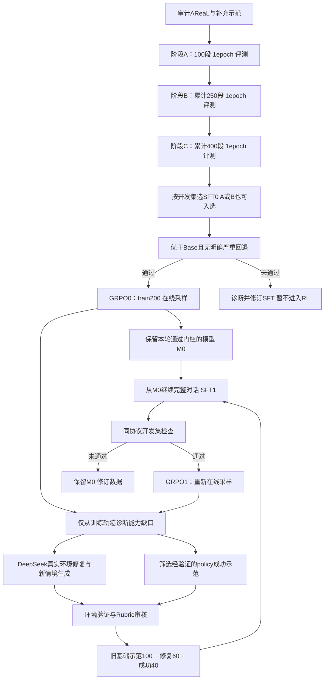

> 2026-09-26 分布先行更新：已完成原999、SFT100/dev52、selection60、实际RL50与final50聚合分布核对，物化782条原轨迹候选及51条新增优先复核索引。详见 [分布、复用与补缺报告](sft_distribution_and_reuse_20260926.md)。400条仍是方向，未冻结为已合格库存；final聚合分布已按用户授权查看，具体答案不进入训练。

# AReaL Airline SFT–RL 数据飞轮迭代计划

> 2026-09-26更新：旧A100的1epoch和3epoch已完成，selection60成功分别121/240、106/240，Base131/240；下文“尚未启动GPU”等为9月25日历史状态。补读Shopping任务并核对固定提交后，确认旧选择器未实现按能力桶分dev。现以[Shopping核对与152条审计](shopping_alignment_and_sft_audit_20260926.md)及`results/analysis/shopping_alignment_20260926/airline_method.json`为当前修订：分组后桶内约10%验证、未知难度待复核、取消未验证的固定难度比例和dev数量；阶段100→250→400为合格库存下的目标，不是已构造数据。历史数据/成绩不覆盖。

实施更新：Stage A 的100条完整训练对话（98源数据+2真实执行补充）、52条独立离线dev及显式assistant mask已通过CPU检查；14工具均有覆盖。累计DeepSeek639次请求、保守费用23.34994/100 CNY。尚未启动GPU。实际分布、judge争议、Qwen3.5前缀差异和待批准预算见 [Stage A准备报告](sft_stage_a_ready_20260925.md)。

日期：2026-09-25。状态：完成源数据CPU盘点；DeepSeek V4.1 Flash的预算受限试审已开始，尚未运行本计划的GPU训练或新交互评测。当前最高优先级：先获得优于Base的SFT，再进入RL飞轮。

目标：建立可审计的“完整对话SFT→在线RL→训练侧诊断与补数→下一轮SFT”闭环，在固定交互评测中逐轮检查能力提升与回退。首轮单seed只提供初步证据；跨seed稳定性需后续重复验证，任何筛选或课程都不预先保证提点。

## 本次修订：按用户要求采用单路线、多轮反馈迭代

- SFT直接使用完整多轮对话；取消决策轮切分及所有预设SFT消融矩阵，保留必要的渲染、监督mask与数据质量检查。
- 恢复第0轮分阶段SFT：A=100段基础示范，B=累计250段加入约束处理，C=累计400段加入策略/多目标示范；每阶段1epoch、结束即评测。100段是重建后的第一阶段，旧100段不原样重用。离线dev另留60–80段。
- 优先使用审计通过的AReaL原始对话；覆盖不足时用用户指定的DeepSeek Flash生成真实环境交互示范，也可担任用户模拟器。
- 只运行一条SFT→GRPO→训练侧诊断/补数→SFT→GRPO路线；取消Base→RL和旧SFT→RL。每个RL阶段建议200个独立训练任务、50个外层step、3,200条候选rollout。
- 新SFT的step0与RL step10/20/30/40/50做同协议评测；已有Base成绩仅作静态参考，不新建Base RL实验。
- 先完成SFT阶段选择，未满足优于Base的开发集门槛时不推进RL。后续飞轮和两轮预算属于条件性后续方案；尚未构造阶段数据/train200，尚未调用生成API或启动GPU。


## 0. 飞轮主流程与每轮边界

### 0.1 借鉴shopping的哪些机制

已经读取shopping的`docs/data-collection.md`、`docs/sft.md`、`docs/grpo.md`、`docs/evaluation.md`：借鉴真实环境teacher采集、确定性结果验证、完整对话assistant监督、能力分层、在线GRPO、冻结Rubric和开发/最终评测隔离。

shopping文档描述的A→B→C是一次累积SFT课程，之后接GRPO；已读材料不足以证明其实施了多轮SFT↔RL闭环。本计划把这些组件组合为Airline的迭代方案，不宣称复现了shopping已有的飞轮收益。其采集文档与当前SFT文档属于不同数据版本，不能把行数或训练阶段混为同一轮证据。



评测支路只用于检查和模型选择，不向数据生成器提供selection/reserve/final的具体失败实例、工具答案或gold。图中的回路是计划流程，不是已运行的自动服务。

### 0.2 初始轮与反馈轮的数据量

| 阶段 | SFT训练包 | SFT配置 | RL配置 | 目的 |
|---|---|---|---|---|
| 第0轮 | A100→B250→C400，累计400段独立示范、750段曝光 | Base→A→B→C，各1epoch，lr3e-5/2e-5/1e-5；预计13+32+50次更新 | 仅SFT晋级后：train200，50外层step，3,200条候选 | 当前先证明SFT优于Base，再启动RL |
| 第1轮 | 200段：基础/历史优质回放100 + teacher修复60 + policy优质成功40 | 从第0轮选定模型M0继续，1epoch，lr1e-5，约25次batch8更新 | 同一train200，50外层step，3,200条新候选 | 修复已确认缺口，并保留已有能力 |
| 后续轮 | 默认仍为200段混合包；按新缺口替换，不无限累加 | 从上一轮通过门槛的模型继续，1epoch | 按新预算批准的独立阶段执行 | 仅在有新数据和有效收益时继续 |

这里100/60/40是初始采样目标，不是必须凑齐的配额。policy合格成功不足时，优先使用不同任务簇的已验证teacher成功示范补齐并记录来源；修复不足且没有新缺口时减少训练包或停止，不重复旧样本冒充新增数据。每个训练包按任务簇控制重复曝光，尽量每簇一条；同任务不同恢复状态若确需保留，记录其共同来源和总权重。

基础回放100段覆盖14工具的合法使用条件、必要询问/确认、合理拒绝、主要业务及难度桶；不能只按最短轨迹选择。修复60段优先覆盖最普遍或后果最严重的2–3类训练侧问题。成功40段优先保留此前易错但现在能正确完成的情境，以及不同的有效行为，避免只收集简单成功题。

**数据仓库可以持续增长，单轮梯度训练包保持有界。** 每轮冻结实际样本、来源、loss mask和曝光清单，不能把全部历代数据每轮重训后仍称为相同预算。

### 0.3 从RL发现什么，怎样决定补哪些数据

使用训练rollout的五维Rubric、九类诊断子标签和真实工具日志建立错误表：task/cluster、checkpoint、首次错误、可恢复性、证据、严重性、是否重复出现、该组是否有成功候选。不同checkpoint的轨迹分别标记，不把历史失败率称为当前策略成功概率。

| 训练侧现象 | 下一步 |
|---|---|
| 同任务组有成功也有失败 | GRPO继续利用已有信号；成功轨迹审核后可入经验库，失败定位首次关键错误 |
| 全部失败，且多任务重复同类参数/政策/依赖错误 | 优先teacher示范、错误前状态重执行及相关训练情境补充 |
| 全部成功且流程合规 | 保留少量代表性回放；不因容易采到而占满SFT包 |
| reward成功但有未获授权动作或虚假陈述 | 不进入成功示范池，核查Rubric和验证器覆盖边界 |
| 服务/DB/grader故障或任务不可完成 | 修工程/任务并隔离；不生成“标准答案”让模型拟合故障 |
| 同签名调用多，但用户改意或观测不足 | 回看证据后判断，不自动判低效或机械删调用 |

每轮输出能力缺口排序及支持样本数。排序综合严重性、跨任务复现和可学习性；不把长度当难度，也不只挑高频而忽略少量严重错误。监控全同奖组比例、实际有效组/更新、动作多样性、KL与长度，辅助区分缺示范、探索不足、评分覆盖或工程问题，不据此自动增加新奖励。

### 0.4 新示范必须是执行后的完整记录

- **正确流程示范**：回到原始或已核验的错误前DB快照，teacher重新交互和执行后续；分叉点后的用户回复和工具回执全部重新生成，不拼接旧后缀。
- **恢复示范**：保留真实错误前缀及确实可恢复的当前状态，再执行合法恢复。仍保存完整对话，但错误assistant回合只作上下文、loss为0；只监督审核通过的正确回合。
- **邻近新情境**：从训练任务结构生成不同实体/约束/条件组合，在有效DB中构建可执行任务；新任务仍属于原训练簇的衍生数据，不能塞入dev冒充独立泛化评测。
- **policy成功示范**：环境成功与Rubric审核均通过才入库；成功标签不能替代检查错误实体、无确认写入、伪造完成或重复补偿。

同一组8条rollout不全收。按任务簇、业务条件和有效决策差异去重；保留完整来源链`task → rollout → first_error → teacher_fork → verifier → accepted_demo`。训练池任务允许同时参与RL和下一轮SFT，这是反馈来源；与评测任务的隔离始终不变。AReaL源SFT无可靠task映射的残余重叠风险单独登记，不能只靠ID不同宣称完全无泄漏。

### 0.5 模型从哪里继续，怎样避免回退

记S_k为第k轮SFT模型，R_k,t为该轮RL节点，M_k为本轮及上一轮中被保留的模型。

1. 第0轮按Base→S_A→S_B→S_C顺序训练；每阶段从上阶段合并权重继续并新建LoRA/优化器/scheduler，记录此参数化选择。按冻结开发规则选A/B/C中的S_0；只有SFT优于Base且无明确严重回退才进入RL。RL_0从S_0开始，step0也参加保留选择；如果RL未改善，M_0可以仍为S_0。
2. S_1从M_0的实际权重继续，不重新从Base开始。导出选定RL权重后训练新LoRA，合并成完整可加载权重；显式记录参数化变化与模型父节点。
3. 每个SFT/RL阶段重新初始化对应优化器和scheduler。SFT→RL后KL reference固定为本阶段SFT起点，整个RL阶段内不改变；不能沿用SFT前RL的陈旧optimizer或reference而不记录。
4. 新SFT必须通过开发集和工程检查才进入下一轮RL。若回退，保留M_0并修订数据；不因计划写了下一阶段就强制替换现有模型。
5. 新RL的所有rollout从当前policy在线生成；旧RL轨迹只用于诊断、审计通过的SFT示范及离线统计，不混入新GRPO当on-policy样本。
6. 每轮保存step0/10/20/30/40/50的推理权重与评测索引用于选择；完整续训状态依项目约定保留最新一份。选中较早推理权重可作为新SFT父节点，但不冒称恢复了其优化器状态。

学习率1e-5是反馈SFT的保守计划值，尚未验证最优。全轮采用完整对话assistant目标mask，1epoch；不做决策轮切分，也不恢复已取消的格式、数据量或Base RL消融。

### 0.6 晋级、停止与最终报告

- 训练任务的成功提升只说明训练侧改善；选择模型仍使用固定selection60×4、相同模拟器和协议。
- 第0轮先比较Base、S_A、S_B、S_C；首要目标是SFT超过Base。建议进入RL的开发门槛为pass@1至少+3个百分点，且pass^4无明确回退、严重业务违规无确认恶化；只有数字略高时先复评，不宣称稳定提升。之后主要与上一轮保留模型比较。它是开发决策门槛，不是统计显著性的保证。
- 修复SFT本身以“总体能力保留、目标缺口改善”为准，不要求每次SFT都立刻+3pp。默认总体pass@1回退超过2pp或确认出现新的严重违规时不推进；较小波动也须检查配对任务变化、pass^4及区间。这些容忍值在开跑前冻结，不能看结果后放宽。
- 严重违规统计使用相关任务分母及证据复核；小样本不宣称“零风险”。未知或噪声过大时保留旧模型，必要时用预先约定的新随机种子复评相邻候选，复评计入预算。
- 每轮固定RL预算结束后决定晋级；不根据训练reward随意续到碰巧高分。连续两轮无实用开发集收益、没有足量新增合格示范，或有效组不足而原因未解决时停止盲目循环，整理诊断再修改方案。
- 首先只规划第0轮和第1轮。第1轮须满足新数据和模型门槛才执行；后续轮次重新列预算，不自动无限运行。
- reserve120默认保持封存至迭代结束；若需要SFT阶段先做独立确认，按§11.1在首次查看前冻结60+60分割和使用时点。final50在冻结协议下做最终报告。不得每轮查看reserve/final再回流造数。
- 报告整个模型谱系、全部尝试、回退和累计训练/API/评测预算。没有Base→RL对照，只能说明这条反馈路线的迭代效果，不能证明优于等预算直接RL；单seed也不能称跨seed稳定。

## 1. 本计划基于什么

已读取任务「分析 SFT 与 RL 选 ck」（01a0d771-5cb8-7e43-9f7e-d14c8c14135b）与「检查持久盘运行结果」（01a0d24b-7462-7fb1-8f7b-a256984b7e3c），并检查其对应代码与报告。

- 主评分归并为五个维度；复用 `configs/analysis/airline_capability_taxonomy.yaml` 的九类能力作为诊断子标签，不要求judge独立给九项分数。
- 复用 `results/analysis/airline_badcase_v1/` 中训练/评测分开、按任务分组的思路；启发式错误标签须重新验证。
- 借鉴 shopping 项目的质量门槛、任务难度与轨迹复杂度分离、固定开发集和课程对照。该项目在不同模型与环境中的结果不能证明 Airline 的三阶段课程有效。
- 主要实验对象是 AReaL 的全部 **999 条 Airline 源对话**；全文件 33,531 行中的 Retail/Telecom 不混入首轮航空工具实验。

原始数据固定 revision：`86971dc03da6e7c1a7933295e05b84aab8215386`；文件 SHA256：`24bc4d479799ef5d5efec7a5388ea2de6bf5dc5ab7c2c83e9b5ee26fa5813804`。

本轮盘点结果和可重复脚本：

- `results/analysis/areal_sft_strategy_20260925/source_inventory.json`
- `results/analysis/areal_sft_strategy_20260925/inventory_source.py`
- `results/analysis/areal_sft_strategy_20260925/reference/`：固定 revision 的 AReaL 数据卡、shopping SFT 文档和难度标注脚本快照。

### 已确认的数据事实

| 项目 | 全量扫描结果 | 对方案的影响 |
|---|---:|---|
| Airline 原始 SFT 决策样本 | 12,842 行 | 每行是历史 + 当前 assistant answer，不是独立任务 |
| Airline 对话 | 999 条 | 以 source_dialog_id 为基础单位去重、分割、统计 |
| correct=1 且 reward=1 | 875 条 | 初始候选池，尚不能称为当前环境验证成功 |
| correct=0 且 reward=1 | 117 条 | 标签冲突池，首轮不直接监督 |
| correct=1 且 reward=0 | 5 条 | 标签冲突池，首轮不直接监督 |
| correct=0 且 reward=0 | 2 条 | 失败分析池 |
| 同一对话标签随 turn 变化 | 0 条 | 不能把 correct 当作已经获得的逐决策质量标签 |
| 含多工具调用的对话 | 994/999 | 多调用是源数据的普遍形式，不能按出现多调用就删除 |
| 原始 assistant 同时含非空 content 和 tool_calls | 0 个回合 | 可作为实际数据格式检查的一项 |
| 原始 turn_index 有缺口 | 19 条、共 38 个非开场 assistant 回合没有独立 answer 样本 | 完整历史恢复后监督所有 assistant 会扩大上游目标集合 |
| 开场 assistant 问候没有独立 answer 样本 | 999 条 | 首轮建议保持为上下文，不额外监督固定问候 |
| 源 messages 与最后一行历史的内容/工具前缀不一致 | 0 行 | 最后一行可恢复可见历史；该检查不比较 reasoning 字段 |
| 源 answer 与恢复历史中对应可见 assistant 不一致 | 0 行 | 可以建立可追溯的目标回合映射 |

当前 100 条训练集中，`airline_dialog_535` 和 `airline_dialog_804` 各含两个上游没有作为 answer 提供的非开场回合，涉及查找不存在的用户以及后续解释。缺失不自动等于错误，其原因尚未证实；但这些回合不应在无记录的情况下自动恢复成监督目标。不能据此断言它们解释了全部 13.75 个百分点退化。

### 必须纠正的归因和指标口径

1. 当前 Base/SFT 同 prompt，SFT 训练也用该 prompt；没有证据将 prompt 差异定为本次退化原因。
2. 当前 `Qwen35SFTTrainer.compute_loss` 对每个 micro-batch 的监督 token 求均值，micro-batch=1 条对话，然后梯度累积。因此不能按“某条对话占全部 rendered token 多”推断其梯度权重更大。1,131,989 是输入 token；实际监督 token 是 **208,687**。
3. 工具数量、重复签名、多调用批次数增加只是行为差异。判断无效调用须考虑前后状态、用户改意和证据需求。
4. `analyze_airline_badcases.py` 的 SFT 评测分支读取了顶层 messages，而实际调用在 simulation.messages，可能把有工具轨迹读成空；先修该解析再使用细类计数。
5. DB hash 改变只能证明发生变化；不能直接命名为“正确写入成功”。写操作返回正常也不能证明满足了全部用户目标。
6. 写工具回执若已包含足够的新状态，无须强制再调用 get_reservation_details。缺少再次查询不能自动扣“结果核验”分。
7. 参数错误引起的 tool error 属于可评分的 actor 错误或恢复场景；服务断连、数据库装载失败、grader 故障才属于基础设施问题。不能整桶混为 simulator_error。
8. `context_window_exceeded` 的历史标签可能包含单轮生成触顶；须核对 raw finish_reason、单轮预算、总上下文预算，分别记录。
9. single_pos/single_neg/double/triple 是来源情景标签。single_neg 不等于坏示范，正确拒绝不符合政策的请求可能是高质量正例。

## 2. 先建立数据账本，保留三种相互独立的量

每个对话记录三条轴：

- **示范质量 Q**：这次 assistant 的行为是否值得模仿，以任务Rubric检查结果和五维分数向量表示，不默认压成加权总分。
- **任务难度 D**：任务本身要解决哪些约束、依赖和例外。
- **模型掌握程度 P**：固定 checkpoint 在可执行任务上多次 rollout 的成功分布。

长轨迹可以是简单任务上的低效示范；困难任务也可以有简洁正确示范。源数据只有一个 teacher 示范时，不能凭该条结果给它标“稳定成功”。没有可执行任务身份时，P 留空。

建议每条账本至少包含：

```json
{
  "source_dialog_id": "airline_dialog_x",
  "source_file_sha256": "...",
  "source_correct": 1,
  "source_reward": 1.0,
  "source_target_turn_ids": [],
  "source_target_message_indices": [],
  "raw_system_sha256": "...",
  "effective_system_sha256": "...",
  "runtime_schema_sha256": "...",
  "scenario_cluster_id": "...",
  "split": "train",
  "task_link": {"status": "unresolved", "task_id": null, "db_hash": null},
  "verification": {"level": "source_only", "official_outcome": null},
  "capabilities_required": [],
  "difficulty": {"level": "unknown", "features": {}, "evidence": []},
  "rubric": {"version": "airline-task-rubric-v1-draft", "requirements": []},
  "quality": {"dimensions": {}, "tier": "pending", "fatal": false},
  "badcases": [],
  "first_error_turn": null,
  "first_irrecoverable_error_turn": null,
  "supervised_turn_ids": [],
  "excluded_target_reasons": {},
  "input_tokens": null,
  "assistant_label_tokens": null,
  "teacher_tool_calls": null,
  "model_trials": null,
  "judge_provenance": {},
  "decision": "pending"
}
```

所有评分、难度、source labels、oracle actions、judge 建议留在 sidecar，不进入模型的 messages。

## 3. 硬检查与环境核验

### 3.1 对 999 条全量做确定性检查

- 验证 source_dialog_id、turn_index、目标回合映射与历史连续性；保留原始目标，不用“最后一行 + 全 assistant loss”隐式扩充。
- 校验当前工具名、参数 JSON、必填及嵌套 schema、调用/回执对应关系；有 ID 按 ID，无 ID 按可验证的顺序及名称匹配，歧义标 unknown。
- 检查 tool observation 是否来自现存记录或真实执行；识别 reward/gold/内部审计信息泄漏。
- 记录错误工具回执、重复读/写、超长输出等候选问题，不把正当恢复、重新确认和必要搜索自动判错。
- 用当前 tokenizer、chat template、thinking=false、14 工具 schema 统计输入 token 与实际 label token；超过 24,576 的完整对话单独分池，禁止直接截掉结尾后当成功示范。
- 校验每个目标回合训练时的可见历史与推理时一致，特别检查 Qwen3.5 的 last-user/thinking scaffold。必须核验逐回合渲染，不能只验证全串总长度。
- 检查可见内容相同但 source ID 不同的副本；按任务条件/实体关系形成近重复簇。

已知 runtime 不兼容：源轨迹中 `update_reservation_cabin` 出现 13 次，覆盖 12 条，其中 5 条 source=1/1。不得只把工具名改成 update_reservation_flights；参数、政策和执行效果必须重新验证。首轮完整轨迹候选隔离这些对话。

### 3.2 分清“源标注成功”和“重放验证成功”

源 SFT 实际 metadata 只有 source_dialog_id、turn_index、reason_for_call、seed_pattern_task_id、correct、reward；没有直接 task_id、db_path 或 evaluation_criteria。与 1,148 条 RL task 的 reason_for_call 精确匹配为 0。

因此不能承诺直接把 999 条全部送当前官方 verifier 重放。设置三级证据：

| 等级 | 能验证的内容 | 不能宣称的内容 |
|---|---|---|
| source_only | 原始标签、格式和监督来源 | 当前环境成功 |
| evidence_audited | 用户指令、可见 observation、政策、参数与子目标一致 | 已经恢复原始 DB 和官方 gold |
| replay_verified | 找到经确认的 task/DB/初始状态，以隔离环境实际执行并核验完整 outcome | 原始 teacher 内部使用的判分过程被复现 |

可尝试依据 user/reservation/flight identities、初始观测及约束定位 DB，但须验证所有关键初始值；`airline_dialog_42` 不能按数字直接配 `airline_42`。仅有相似意图不够。

每次重放创建隔离的 agent DB 与 reference DB，检查全部 required outcomes、communicate_info、政策及不应变更实体；仅最终 DB 相等并不足以覆盖所有要求。若只有 DB 可确认，记录 execution_verified，official_outcome 仍为空。

首轮允许高质量 evidence_audited 原始数据入池，单独报告证据等级；新的修复/补充轨迹必须真实执行。纯 evidence_audited 与 replay_verified 的效果可以后续分层分析，不能混写为同一等级。

## 4. 任务Rubric、五维主评分与诊断标签

Rubric是“这个具体任务做到什么才算符合要求”的评分细则；五类能力名称本身不是完整Rubric。先冻结任务检查项，再按证据逐项判断，最后汇总为五维主评分和具体badcase。

### 4.1 为每个任务生成可检验的Rubric

从可信任务要求、用户实际表达和当前政策提取检查项；不根据assistant已经做了什么倒推标准，也不读取source reward决定是否放宽要求。没有完整task spec的SFT样本标明Rubric仅覆盖可见需求。

每项包含 `requirement_id`、`criterion`、`source_refs`、`available_from`、`applies_when`、`severity`、`verification_method`。审计结果另存 `satisfied / violated / unknown / not_applicable`、`evidence_refs`与简短原因。

例如一个示意任务：“把指定订单改到5月26日，增加2件托运行李，使用指定信用卡”，其Rubric可以是：

| 检查项 | 具体要求 | 证据与适用条件 |
|---|---|---|
| R1 目标绑定 | 使用用户指定订单、航向及5月26日日期 | 用户消息与查询结果；缺订单号时先澄清 |
| R2 方案与费用 | 选择满足已表达条件的可用航班，正确说明费用 | 搜索结果、当前订单、适用政策；不得臆造报价 |
| R3 执行前提 | 写入前具备所需资格、参数和明确确认 | 必须来自该动作发出前的消息；后续确认不能补证 |
| R4 行李与支付 | 按用户明确含义处理“增加2件”的新总数，并使用指定卡 | 核对原行李数、用户澄清及工具参数语义 |
| R5 子目标收口 | 改签和行李均完成，或依据政策正确解释不能执行的部分 | 写回执/必要查询与最终答复一致；不误改其他订单 |

这只是格式例子；没有明确路线、价格、卡号时不能自行填入。真实任务可能需要额外的保险、乘客、预算或补偿检查项。合理拒绝按照该任务政策条件评判，不预设所有请求都必须执行。

同一评测任务共用固定的基础Rubric。交互中新增/改变的用户要求依据冻结的提取规则建立时间化ledger，记录何时生效，不为不同模型结果另写宽严不同的标准。Rubric作者只看到授权的任务需求/可见证据，不把私有gold动作或答案转写进过程judge输入；隐藏目标由独立verifier判定。

### 4.2 主评分压缩为五维

每维0=有明确错误，1=部分满足或存在非严重缺口，2=适用检查项有充分证据且处理完整；另设unknown和not_applicable。评分必须引用具体Rubric项和消息，不能凭整体印象给分。

| 主维度 | 核心问题 | 原九能力的对应关系 |
|---|---|---|
| 目标与约束理解 | 是否理解所有已表达目标及约束，及时处理变更？ | intent_understanding |
| 证据与参数准确性 | 工具名以外的参数、状态与引用事实是否有依据且格式正确？ | state_reading、schema_use、argument_binding |
| 动作选择与合规 | 工具、资格、确认、依赖顺序和批量执行是否合理？ | tool_selection、call_order |
| 结果与任务完整性 | 应完成的子目标是否完成，结果判断和最终说明是否可靠？ | database_mutation、result_verification |
| 终止与效率 | 是否在适当时机结束，避免可证实的无效重复？ | dialogue_termination及重复行为标签 |

例如“参数绑定错”可以同时影响结果，但先按原始错误标到证据与参数维度，结果维度记录其后果；数据筛选不把同一错误的多个标签当作多次独立扣罚。

### 4.3 九类能力仅作为定位错误的子标签

按相关行为触发子标签，不为每条轨迹强行填满九项评分。保留它们是为了定位修复数据和兼容已有badcase分析。

| 能力 | 评分依据 | 必须识别的典型错误 |
|---|---|---|
| intent_understanding | 已表达的子目标和约束清单是否完整 | 漏掉改签后的行李目标；合理拒绝误当漏做 |
| state_reading | 引用的日期、订单、乘客、价格是否来自当前观测 | 把返程当去程；忽略当前舱位 |
| schema_use | 工具名、必填与嵌套结构可执行 | DOB/payment/amount 缺失或结构错 |
| tool_selection | 当前子目标及已知状态是否需要该工具 | 不该取消却取消；无业务必要的新订票 |
| argument_binding | 目标实体、日期、金额、用户确认与参数一致 | 错日期、错订单、错支付卡、错乘客 |
| call_order | 每个调用发出前的参数、资格和确认是否已满足 | 尚未看到搜索结果就生成依赖它的写调用 |
| database_mutation | 目标状态变化和未授权副作用 | 误改其他订单；只完成部分子目标 |
| result_verification | 是否正确读取写回执/必要查询并据此回复 | 写失败却声称完成；忽略不完整回执 |
| dialogue_termination | 完成/合理拒绝后能正常收口 | 重复输出、无依据转人工、未完成即结束 |

逐轮记录 `decision_turn`、`tool_call_index`、所需前提、已知参数来源、确认消息索引、实际 tool result、具体错误标签与证据。对每个写操作逐个核查，不能一个 batch 只打一个粗分。

另建子目标 ledger：`requested → clarified → confirmed → executed/denied → verified → communicated`；每条边保存消息/回执依据。该 ledger 解释 partial_completion，比统计工具名更直接。并非所有子目标都必须经过写入分支。

### 4.4 硬淘汰与质量分层

严重问题独立 hard gate，不允许被其他维度高分抵消：无依据的资金/订单变更、错误实体写入、伪造工具结果、明知失败却宣称成功、破坏因果历史、无法区分任务身份的重放伪证据。

可修复问题进入 repair 队列；事实不足进入 uncertain。未证实严重错误时，不能仅凭一个 judge 判定删除。

不使用九项加权总分及Q≥85门槛。保留任务检查项状态和五维向量，暂定：

- A类：硬检查通过；关键适用Rubric项均满足或属于合规拒绝，无critical unknown；前四维适用项均为2，第五维至少1。用于首轮优质池。
- B类：没有已证实fatal，但存在信息不足或部分缺口；进入复核/修复，不能因语言流畅而升级。
- C类：有已证实严重错误或不可靠来源；隔离原轨迹，需要重构才能成为监督正例。

规则在80条训练侧校准集上修订一次后冻结，不根据selection/final成绩反复调。缺失维度不能按满分计算。Q400中的Q只是quality数据版本名，400指完整对话数量。

效率只在证据与业务要求满足后用于同一任务簇内的 tie-break。不按绝对工具数或总长度扣分，不把“最短”当作高质量定义。重复核验、用户改意、工具返回不足可能合理。

## 5. 难度分层：任务难度、执行复杂度和模型成功率分开

任务难度 judge 主要看任务约束、用户需求 ledger 和必要环境事实；看不到质量总分、模型名、源 reward。SFT 无完整 task spec 时标 observed_task_difficulty，不能假装掌握未披露目标。

建议记录六个 0/1/2 特征：

1. 约束组合：日期/时段/路线/舱位/支付/人数等是否相互制约。
2. 实体绑定：涉及几个订单、乘客组、支付账户，是否易混淆。
3. 必要依赖深度：查询→判资格→确认→修改→处理后续变化。
4. 政策边界：保险、取消窗口、basic economy、证书/补偿资格等。
5. 条件分支：预算不够、无直飞、用户改意、工具失败后合法恢复。
6. 证据歧义：请求与记录冲突、可选方案需比较、信息需澄清。

暂定总分0–3=easy，4–7=medium，8–12=hard，并保存每项依据；在训练侧校准后冻结。另报 observed trajectory complexity：assistant 回合、工具次数、调用批次、最长依赖链、input/label tokens。复杂度不直接替代难度。

课程技能桶：

| 桶 | Airline 含义 | 例子 |
|---|---|---|
| foundation | 单一目标、明确实体、常规合法流程 | 确认后给指定订单增加行李，读回执并告知 |
| constraints | 多条件约束或政策资格判定 | 日期+舱位+支付卡绑定；不符合政策时正确拒绝 |
| strategy | 跨子目标依赖、动态调整或恢复 | 改签后重算行李；无航班时询问替代；多订单约束 |

能力桶是多标签，课程主桶可单选；“多任务=hard”“负请求=坏样本”“使用多个工具=低效”都不作为规则。

只有可执行的训练任务才测 Base/候选的4次或8次 rollout 掌握程度。4/4、1–3/4、0/4分别称“本次全成功/混合/全失败”，样本少时不声称真实成功率为1或0。同一 checkpoint、task、协议、采样预算内分组；不把 GRPO 不同步数的 rollout 混在一起推断一个固定策略的难度。

## 6. Judge 的输入、校准与成本

用户已确认DeepSeek V4.1 Flash及本批100 CNY上限。配置见`docs/deepseek_rubric_setup.md`，使用独立`TAU3_JUDGE_BASE_URL/MODEL/API_KEY`；官方请求名为`deepseek-flash`。鉴权、真实JSON探针及39项CPU测试通过，80条训练侧两遍试审已开始；无人工金标和独立judge验证，不称为完成正式校准。

设置两种职责：

- **任务标注器**：提取任务 rubric、能力需求和难度；禁止把 teacher 绕路当作困难来源。
- **轨迹审计器**：按冻结 rubric 和当前政策检查参数来源、资格、确认、结果读取、子目标完成与终止；输出结构化证据和问题定位。

轨迹审计器不看模型身份、source correct/reward、其他模型成绩、私有 gold actions。官方 verifier 独立运行，它可以使用 gold，但 gold 不传给过程 judge 或 actor。逐轮判定只使用当时可见前缀；后续用户补充不能反过来证明 earlier action 当时有依据。终局完成评估才使用完整可见对话。

长轨迹以决策窗口+可核查状态账本审计，保留原消息索引和完整关键回执。不能盲目截取工具输出头尾后仍给确定结论；证据缺失就标 unknown 并回读原文。

校准步骤：

1. 从训练侧抽80条：覆盖三种能力桶、合理拒绝、source标签冲突、批量读/写、超长/重复、工具错误恢复。不能从 final50 抽样。
2. 两个独立 judge/审计者复核；其中至少30条形成经人工逐条核对的金标，其余争议逐条裁决。没有独立人工金标时，只能报告模型间一致性。
3. 统计严重违规 precision/recall、各维度一致性、unknown率、证据引用正确率；暂以严重违规 precision≥95% 作为允许自动拒绝的门槛，须同时报告样本量和区间，达不到就只生成 review flags。
4. 第一轮对通过静态门槛的候选做主 judge；第二 judge 覆盖所有高风险写操作争议、低证据样本、质量分层边界样本及20%随机抽查。两个 judge 不先互看结论。
5. judge 的模型版本、prompt/rubric hash、输入哈希、输出JSON、重试和花费全记录；单次超时或非法JSON标 not_judged，不填0。

主 judge 优先选独立于当前 policy 的强模型，避免仅用同一个用户模拟器自证。具体模型先跑80条校准再定；不根据谁更容易给高分选 judge。评测上的 judge 分项仅诊断，不与官方成功率加权成新总分。

全量预算按实际eligible数和token统计冻结：任务标注、质量主审、复审约20%加争议；大致上限约2,300个逻辑样本审计。用户后续“继续”授权下，已在同一100 CNY累计账本内完成控制复核和227条候选/dev审查；没有审计全999条，正式全量前仍需独立复核及规则校准。

## 7. 数据集构造与14工具覆盖

### 7.1 去重和划分先于抽样

以 source 对话和任务簇切分，不把同一轨迹的不同 assistant 决策轮分到 train/dev。簇指同一底层任务实例或近重复变体；共享通用技能/源模板并不自动等于泄漏。

匹配使用任务目标、约束结构、实际实体及初始状态；词面相似度只做候选筛查，不单独证明语义无泄漏。对固定 selection60、final50以及新封存的 reserve确认集，只做独立防泄漏检查；不把其答案、轨迹或具体失败实例写进训练样本。

- offline SFT dev：从未参加过现有SFT梯度的合格源簇中固定约10%，目标60–80条，覆盖三类能力。只用于监督拟合和mask健康检查。
- selection60：已反复使用的开发任务，承认它参与了方法探索；用于阶段筛选与checkpoint选择。
- reserve确认集：建议从未被查看/用于调参的 reserve 中预先封存120个可执行任务，隔离相关训练簇；如果使用历史已污染，应重新划分并披露。
- final50：模型与协议冻结后使用一次，不参与 judge 校准、难度阈值、数据配比或选 checkpoint。

没有 task/DB 映射的 offline SFT dev 无法直接做交互评测；禁止把其teacher loss称作任务成功率。

### 7.2 正式SFT分阶段使用100→250→400段完整对话

构建嵌套`Q100 ⊂ Q250 ⊂ Q400`，400是最终独立训练对话目标数，离线dev的60–80段另计。从875段源标签合格候选中先执行硬检查、去重、划分和Rubric审计；不能把875当作已审计可用数。先冻结分层和阶段规则，再依次训练100/250/400的课程阶段；这不是从Base独立开三组的数据量消融。

优先使用原始AReaL高质量对话，按能力缺口加入真实执行的合成示范。初始合成占比上限建议25%（最多100/400段），并非必须生成100段；不足400时先报告实际合格数量和缺口，不降低质量标准或复制轨迹凑数。旧3条补充示范重新审核，不强制保留旧41条anchor。

foundation/constraints/strategy初始目标为30%/45%/25%，即120/180/100段；正确拒绝/资格不足约15%（约60段），与上述桶交叉计数。冻结前根据实际候选池调整。保留日期/订单/支付绑定、政策边界、多目标收口与真实恢复的覆盖。

按“质量门槛→任务簇去重→能力缺口→难度/业务分层”选取。不按工具等频抽样；报告每个工具涉及的独立任务数、合规参数、适用业务条件及正确不调用案例。稀有工具优先争取5–10个不同训练情境的合法使用示范；这是覆盖目标，不能为了达到数字制造无业务必要的调用。

### 7.3 稀有工具与DeepSeek补数

| 工具 | 全999条对话覆盖 | source=1/1覆盖 | 策略 |
|---|---:|---:|---|
| calculate | 4 | 2 | 只补确有计算需求的情境 |
| list_all_airports | 15 | 11 | 覆盖合理使用条件，避免诱导无关查询 |
| send_certificate | 0 | 0 | 在具有真实资格条件的训练任务上补充 |
| update_reservation_cabin | 12 | 5 | 当前不兼容，隔离或在当前工具集重新执行 |

源数据14种工具名与当前14种工具不完全相同。send_certificate补充同时覆盖符合资格、资格不足、避免重复发送、金额和用户绑定；拒绝案例不计作正向工具调用数。

用户已更新为DeepSeek V4.1 Flash；官方API请求名`deepseek-flash`，官方价格及型号页快照保存在试审目录reference中。记录endpoint、请求model、返回model、日期和prompt hash；API返回别名不等于取得精确权重revision。当前付费调用限Rubric试审，teacher补数和用户模拟器尚未启用。

生成流程：

1. 先冻结训练/dev/selection/reserve/final任务簇。从允许的RL训练池或单独隔离的合成训练池选取任务、真实初始DB及独立验证规则；训练任务不足时可设计新任务，但须先验证其可执行性和grader。
2. Teacher仅接收actor应看到的当前政策、工具schema、历史和真实工具返回；用户模拟器仅接收对应用户角色允许掌握的任务信息。两者使用独立会话，隐藏gold不得泄漏给teacher。
3. Teacher与用户模拟器逐轮交互，工具在隔离环境真实执行。DeepSeek可以生成assistant决策和用户回复，不能编造工具观察、最终数据库或成功标记。
4. 官方可执行任务先通过原有verifier，再过政策/确认/参数/完整性Rubric审计。新自建任务的自建grader结果单独标注，不能称作官方任务成功。
5. 通过审计的完整轨迹进入Q400，保留模型来源、task/DB身份、调用回执、token/费用及过滤原因。每个任务的多个候选不冒充多个独立任务；优先保留一个合格示范。
6. Teacher与用户模拟器可使用同一个DeepSeek模型，但审计要加入独立复核和确定性检查，避免仅凭同模型自评放行。只保存可见assistant内容与工具调用为训练目标，不保存私有thinking为目标。

先做20个训练任务的生成试批，每任务最多3个候选（至多60条生成轨迹），根据合格率、能力缺口、调用耗时与实际token决定后续规模。这里只定义计划上限，不预估未经验证的单价或成功率。

### 7.4 用户模拟器安排

- 补充SFT数据：允许使用DeepSeek作teacher及独立会话的用户模拟器。
- RL训练：优先继续使用现有Qwen用户模拟器；DeepSeek作为可选替代，先验证用户角色遵循、停止协议、API延迟、并发与费用，正式run启动前冻结一种配置，run内不混换。
- 固定selection/reserve/final评测继续沿用现有Qwen模拟器及协议，便于与既有成绩比较。如果将来统一更换评测模拟器，建立新协议并重评相关checkpoint，不能直接拼接旧成绩。

## 8. 训练样本与监督目标

### 8.1 重建完整轨迹的含义

会重建，用于全局审计、难度标注、子目标检查和默认完整对话SFT。重建遵循源记录，不让LLM补写已经发生的历史：

1. 按source_dialog_id收集原始逐决策样本，排序并检查分支/重复/缺失。
2. 以最后有效样本的messages加answer恢复历史，验证其与前面各行可见前缀一致。
3. 把每行原始answer定位到完整历史的message_index，建立可监督目标集合；单独记录没有独立answer的问候或中间回合。
4. 原始版本只读保留；当前prompt、工具适配、审计标签和监督mask保存为新版本。
5. 工具观察与用户内容保持真实来源。需要修复的案例，从经确认的初始/中间状态重新执行并生成后续对话，保存成独立衍生轨迹，不与旧后缀拼接成假记录。

999条是审计全集，不承诺全部用于训练；长度、工具兼容性、来源和质量门槛会缩小训练池。不能用来自不同源对话的相似片段拼一条示范。

### 8.2 默认SFT方案

默认保持完整多轮历史，并仅监督审计通过且有明确来源的 assistant 决策。user、system、tool observations全部mask。保留完整对话并不是把整段token都算loss。

因果注意力下，某个assistant输出只能利用其前面的历史，即使整条轨迹在一个batch中，后面的用户/工具结果也不能泄漏给该决策。实际模板和mask需按P0核验。

首轮统一非thinking；不把judge反思、teacher私有thinking或长解释额外灌入目标。自然语言中必要的询问信息、确认、政策拒绝和最终答复仍须训练，不能退化成只教tool calls。

本轮唯一训练形式为**完整对话+获准assistant目标mask**：每段完整对话作为一个样本，一次前向监督其中全部获准assistant输出；system/user/tool均不算loss。源数据缺失的answer回合和固定开场问候默认仅作上下文。新的真实执行补充示范，以明确审计通过的assistant回合作为目标。

不再构造决策轮切分训练集，不安排两种格式对照。逐回合前缀比对仅为正确性检查；如完整对话渲染与推理前缀不一致，修复渲染后继续采用完整对话方案。超过长度预算的轨迹先隔离；不静默切分或截掉结尾。

损失按每段对话的获准assistant token求均值，再在对话间平均；维持micro-batch=1及正确的梯度累积归一化。这样每段来源对话作为一个训练样本，不额外按拆分轮数重复赋权。默认不做长度加权或关键动作加权；第0轮采用§9累积课程，并显式记录重复曝光。

## 9. 当前优先：分阶段SFT先超过Base

此前把阶段课程简化成400段单次SFT，不符合用户本轮澄清。现在保留100段起步及shopping式能力递进；取消的是独立消融矩阵，不取消顺序训练阶段。

| 阶段 | 训练集（累计） | 初始能力分布目标 | 初始化 | epoch / lr | 预计更新 |
|---|---|---|---|---|---:|
| A 基础 | Q100：100段 | 基础流程100；包含必要确认、参数绑定和合规拒绝，不全是问候/简单查询 | 原始Base | 1 / 3e-5 | 13 |
| B 约束 | Q250：包含A，新增150段 | 基础120 + 约束130 | A合并模型 | 1 / 2e-5 | 32 |
| C 策略 | Q400：包含B，新增150段 | 基础120 + 约束180 + 策略100 | B合并模型 | 1 / 1e-5 | 50 |

以上数量、能力分桶和lr为计划默认值，审计/生成可用池不足时先报告。Q100不是此前97+3的旧数据集；全部重新审核并按阶段构建。每阶段均为完整多轮对话+获准assistant目标mask，非thinking、max_length24576、LoRA r16/alpha32/dropout0.05、micro-batch1×accum8、seed42。最终覆盖当前14工具的合法条件；不强迫基础阶段包含只在复杂情境才合理的工具调用。

B/C从前阶段合并模型继续，新建LoRA及优化器/scheduler，逐阶段记录父模型。沿用shopping累积课程结构，但不照搬其效果结论。A中100段曝光3次，B新增150段曝光2次，C新增150段曝光1次：总计400个独立对话、750次训练曝光，预计95次更新。它不等于Q400只训练1epoch，也不能证明课程优于混合训练；本轮不另开课程消融。

更新数假设有效batch8、保留最后不满batch并完成更新。实现时核查末尾累积梯度归一化，不能让阶段A/B最后4条/2条样本被静默丢掉或错误缩放。模板、完整因果历史和缺失目标mask检查必须先通过。

每阶段训练完立即做selection60×4评测，保留A/B/C模型和全部结果。下一阶段不必须已经超过Base才能探索新增能力；但如果当前阶段出现明确总体退化（默认较父模型pass@1下降超过2pp，结合配对变化及统计不确定性复核）、严重业务错误或格式异常，就先诊断，不机械继续。阶段间新增样本按预先冻结的能力分层取，不能复制selection具体失败来补数。

当前比较表必须同时保留Base和历史旧SFT（H0）。最终按同协议主成功率、一致性、严重违规选择A/B/C；C不自动胜出，Base也保留为回退候选。如果没有SFT达到§11门槛，就继续解决SFT数据/训练问题，RL不作为挽救退化SFT的默认下一步。

当前阶段最多3个SFT训练、720条selection评测；Base若身份/协议核验不足需重评240条，合计960条。只有少量优势或结论不确定时，额外预算用于Base和选定SFT的配对复评，而非恢复大量消融。后续反馈SFT200仍属于获得合格冷启动并完成RL之后的方案。

## 10. 如何使用已有badcase与GRPO训练轨迹

从指定任务沿用九类诊断标签与四类经验分组，主评分采用上面的五维Rubric体系；先修解析并将启发式标签升级为“flag/evidence_confirmed/unknown”。历史细类频次不是人工金标。

训练侧1920条GRPO rollout可用于定位实际策略容易到达的错误状态：记录checkpoint、task、group_uid、第一次错误、是否可恢复、可见证据、最终结果。只有训练任务可以生成新监督数据；selection60的具体失败轨迹、标准动作和最终答案禁止加入。

优先补四种能力：

1. 日期、订单、乘客、支付字段的证据绑定。
2. 合法的批量调用与必须等待observation的依赖区别。
3. 多子目标的完成清单，包括应该拒绝的请求。
4. 工具回执核验与简洁准确的结束。

修复方式：保留真实错误前缀→从确实可恢复的状态继续执行正确动作→获得新工具回执→完整outcome验证。错误动作和长反思不作为正确目标；正确修复段有单独mask及来源。不可逆错误只能回到动作前隔离快照重新执行，不能在坏DB上写一个虚构好结尾。

这种修复数据属于policy产生的状态下的恢复监督，与原始teacher成功示范分开标记。没有源task/DB时只提取能力缺口，不能伪造验证成功。

本轮只保留新SFT之后的基础GRPO训练，记录同一起点在RL前后的变化。取消不同初始化分支后，不能据此证明SFT优于直接Base RL。

### 10.1 RL使用可执行任务，在线生成新的交互轨迹

从AReaL RL task manifest读取用户场景、db_path、initial_state及evaluation_criteria。每条rollout独立初始化DB，当前policy与固定用户模拟器交互，实际执行工具，再由当前环境verifier得到终局结果。原始SFT示范用于初始化policy；不把其静态答案和源reward作为GRPO的on-policy rollout。

第一轮采用基础GRPO、终局任务奖励和固定KL约束。Rubric/judge用于离线数据筛选与能力诊断，暂不作为新增过程奖励。不同时修改GTPO、Fatal-aware或工具奖励。

**每轮仅运行当轮新SFT→GRPO。** 不运行R-Base或R-OldSFT；保留该SFT的RL step0成绩，按§0生成下一轮数据并检查是否继续，不声称得到了SFT相对Base直接RL的因果收益。

### 10.2 RL用多少数据

源清单有1,148个Airline RL任务记录；这是盘点数，不是全部可直接用于训练的数量。剔除dev/selection/reserve/final及其近重复簇、验证task/DB/grader可执行性后，目标选择**200个独立训练任务**，冻结为`train200`。先检查原train50的身份和覆盖，合格者可纳入，再补150个不同任务；不为保留旧任务而放宽标准。

| 数量口径 | 本轮计划 |
|---|---:|
| 独立RL训练任务 | 200个 |
| 每个外层step任务组 | 8组，单step内不重复任务 |
| 每个任务组在线rollout | 8条 |
| 每个外层step候选轨迹 | 64条 |
| 外层训练step | 50 |
| 总候选轨迹预算 | 3,200条 |
| 总任务组曝光 | 400次；每个任务调度2次、共16条候选轨迹 |

任务表用两个独立打乱的完整遍历，每遍200任务、25个外层step，确保每个任务都参与；不是从200中无约束随机抽取导致部分任务从未见过。第二遍使用当时更新后的policy在线生成，不复用第一遍答案。没有学习信号的组、执行失败、过滤后有效轨迹和实际optimizer更新数另计；3,200不能称为3,200条成功或有效梯度样本。

这是每轮扩展训练预算；第0、1轮优先固定同一个train200与同一调度规则，各轮重新生成轨迹。旧train50/20step/1,280条仅保留历史说明，不再是默认配置。本轮与历史E0–E3任务池、曝光和预算不同，不能作为匹配预算的算法对照。如果清理后凑不齐200个合格任务，先公布实际数量及覆盖，不能加入保留评测任务补数。

SFT对话数与RL任务数是不同单位。允许用RL训练任务生成补充SFT示范，但必须记录这种重叠；它不属于测试泄漏。所有评测任务及其衍生轨迹均隔离。

### 10.3 RL超参数、运行与评测

初始候选配置：全参数GRPO、actor lr=1e-6、KL系数0.01、policy/user temperature=0.7、非thinking。KL reference固定为本次新SFT初始化；动态过滤首轮关闭，不补采样。上述是计划默认值，需通过工程smoke核验。

每轮step0/10/20/30/40/50分别评测selection60×4；6个节点共1,440条评测轨迹，其中step0可复用身份与协议完全一致的新SFT独立评测，因此SFT后新增训练内评测为1,200条。评测轨迹不计入3,200条训练预算。每10step保存并按项目约定轮换完整续训checkpoint，保留全部日志、轨迹与评测结果。

双A800先验证现有模拟器占一张、策略训练/rollout分时占另一张及CPU offload的可行性。如果经核验改用外部DeepSeek用户模拟器，可评估两张卡用于policy的布局，配置和有效batch必须重新确认；不能承诺全参数训练一定能装下。改LoRA或精度路径时记录为新的实现条件。

独立smoke只验证加载、权重同步、真实交互、参数更新、保存/恢复；随后正式训练从冻结SFT起点重新开始。smoke不是效果消融。本次只修改文档；执行GPU前按AGENTS.md列出具体用途、预计耗时和资源预算。

不安排额外RL难度采样消融；train200先按业务、能力、难度分层选择，然后按上述均匀任务遍历执行。极难任务若始终无成功信号，先检查环境和可学习性，记录为后续数据补充依据，不用训练reward上升代替泛化评测。

## 11. 选checkpoint与“稳定提点”的验收

### 11.1 当前SFT阶段的评测流程

1. 固定selection60的60个可执行Airline任务及各自初始DB；每模型、每任务4个预先固定trial seed，合计240条真实交互。seed根值42；固定同一seed表，不宣称不同模型会因此得到完全相同用户回复。
2. 对比对象为Base、S_A、S_B、S_C；旧H0作为已失败历史配方参考。使用现有`tau3_eval_legacy_v1`、当前`airline_sequential_multicall_v1`政策和工具协议、Qwen3.8-27B-AWQ-INT4用户模拟器、policy/user temperature0.7、max_steps30（orchestrator步数，不能称30个assistant回合）。
3. 冻结checkpoint/tokenizer、schema/prompt、服务精度、thinking及生成/上下文预算。legacy协议的一些预算来自服务默认值，必须核验实际服务启动配置；不能只凭harness名称相同就认定可比。若采用新的输入/token协议，Base与所有候选一起重评，不继续拿旧54.58%作严格基线。
4. 每条轨迹实际执行工具，调用固定版本任务验证器。使用任务声明的reward_basis；已核对的Base文件中213条记录有DB+COMMUNICATE依据，27条无该breakdown，不能编造其逐项成功情况。完整任务成功按reward在1±1e-6内判定；max_steps等模型失败仍计入结果，未解决基础设施错误使结果不完整，修复补齐后再发布总分。
5. DB检查比较预测终态与参考目标终态，COMMUNICATE检查任务要求的必要信息传达；不能用调用次数、DB发生变化或任意LLM印象分替代。工具轨迹是否必须逐步匹配由任务reward_basis决定，不普遍要求复刻gold动作序列。
6. 另对完整轨迹跑冻结Rubric的五维诊断和确定性行为审计，解释提点/回退；过程judge不替代任务验证器，也不与成功率加权成一个总分。先修旧SFT工具调用解析缺陷。
7. 逐task比较四次中的成功次数变化，报告改善/回退任务及按task聚类bootstrap区间；按业务、难度、相关能力分母分组。每阶段同一任务和Rubric，不因某阶段结果修改评分。

已完成历史同协议成绩（不是新课程结果）：

| 模型 | 成功轨迹 /240 | pass@1 | pass@4 | pass^4 |
|---|---:|---:|---:|---:|
| Base | 131 | 54.58% | 73.33% | 33.33% |
| 旧100段SFT H0 | 98 | 40.83% | 65.00% | 15.00% |
| 新阶段A/B/C | 待运行 | 待运行 | 待运行 | 待运行 |

若Base仍为131/240，实用+3pp开发门槛对应至少139/240=57.92%，但多8条成功不自动证明统计显著或稳定提升。先检查配对区间、一致性和严重违规，必要时对Base与选定SFT用新的固定trial seed表复评；公开全部评测，不能挑一批高分。达到开发门槛才允许后续RL；如果需要先作SFT独立泛化确认，可把封存reserve120预先拆为SFT确认60与飞轮末确认60，仅SFT模型名单冻结后启用前者，后者保持封存。使用过的确认集不再称盲集，其具体失败不回流训练；final50始终留到全部配方冻结后。

selection已被反复用于探索，只能作为开发证据。离线SFT dev的loss仅检查拟合健康，不能证明超过Base；最终泛化结论需独立确认。默认当前先完成阶段评测与配对复核，确认集是否拆分在首次查看前冻结，不通过看成绩决定分割。

### 11.2 指标与后续飞轮验收

**主指标**：官方pass@1；报告pass@2/4、pass^2/4、所有任务分母、不可评分数、各能力/难度子组。judge维度只辅助解释。

同时报告：错误实体/金额写入、无确认写操作、必要目标遗漏、可证实的无效重复、正常结束、max_steps、单轮长度、总上下文超限、工具错误与基础设施错误。工具调用总数作为描述，不直接越少越好。

能力评测输出三个独立面板：

| 面板 | 判定来源 | 主要输出 |
|---|---|---|
| 任务完成与稳定性 | 环境verifier和重复试验 | pass@1/2/4、pass^2/4、逐任务成功数 |
| 过程能力 | 固定任务Rubric+五维judge | 目标理解、证据参数、动作合规、任务完整性、终止效率；逐项证据与unknown率 |
| 行为和故障 | 确定性日志/状态审计 | 业务错误、工具错误、重复、步数/长度终止、服务或grader问题 |

五维面板按适用任务报告分母，unknown单列；一个task四次rollout仍作为一个统计cluster。同时按业务（订票/改签/取消/行李/乘客/补偿与合理拒绝）、难度（easy/medium/hard）和能力桶展示成功率与回退，不仅报告全局平均。不能把整体错误数减少解释成某能力改善，除非对应检查项和任务分母可比。

pass@4表示四次中至少一次成功的任务比例，pass^4表示四次全部成功的任务比例（本计划每task恰好四次）。用前者看能否偶尔完成，用后者看一致性；两者不能互换。

SFT比较各阶段epoch末checkpoint并按开发集选阶段；RL报告step0/10/20/30/40/50学习曲线、固定预算step50成绩，并额外报告按selection选定的checkpoint。固定预算成绩与开发集选中成绩分开。

固定user simulator版本、policy/user采样参数、seed计划、harness版本、schema/prompt hashes、上下文与交互预算。改变max_steps/生成guard等必须建立单独实验，不能把放宽预算当作SFT提点。

效果验收的建议标准（训练前冻结；不增加默认训练分支）：

- selection60首轮相对已有Base、后续相对上一轮保留模型检查收益；晋级/保留规则见§0.6，不把+3pp当作显著性结论。
- pass^4和严重业务违规无明显恶化；对小分组给出样本量与区间，证据不足写uncertain。
- 首轮一个训练seed，不宣称跨seed稳定。如后续要给出稳定性结论，另做3seed重复确认并完整报告；不默认纳入本轮预算。
- reserve默认在迭代结束后120×4确认；若预先按§11.1拆为60+60，则分别用于冻结SFT和飞轮终态确认。按匹配任务做差值和**task聚类bootstrap**（保留每task全部trial），如有多seed同时报告seed离散程度，不把240/480条轨迹当作完全独立样本。
- 稳定提升的证据：平均收益有实用大小、各训练seed方向基本一致、任务聚类95%区间支持正收益、关键子组未出现明显回退。若区间跨0，只能说有提升趋势。
- 配方冻结后，Base和最终候选在final50×4上评测一次；若承诺跨seed稳定性，候选3seed均报告而非挑最优。失败/不可评分不能静默删除后抬高分数。

3个百分点在60任务上可能无法可靠分辨；不足时增加独立确认任务优先于反复试同一小开发集，仍须报告最终样本量的局限。

本轮不安排epoch消融。每个SFT阶段固定1epoch；SFT阶段/RL checkpoint选择顺序预先固定为主成功率→一致成功率→严重违规→效率。最终盲测不用于选择训练轮数或修改配方。

## 12. 飞轮执行阶段、预算与交付

| 阶段 | 工作 | 交付与通过条件 |
|---|---|---|
| P0 | 解析修正、监督来源与完整对话token/template审计、数据簇划分 | inventory、目标映射、冻结manifest；当前仅源盘点完成 |
| P1 | 80条judge校准、候选审计、构建Q400/dev/train200 | Rubric、来源、14工具条件覆盖、数据hash、split审计 |
| P2（当前核心） | 第0轮SFT A100→B250→C400，各1epoch、各自评测 | A/B/C及Base配对报告；选出优于Base的S_0，否则继续修订SFT |
| P2-RL（条件性后续） | 只有SFT晋级后启动GRPO0 | 在线轨迹、学习曲线、保留模型M_0 |
| P3 | 训练轨迹错误图谱、DeepSeek真实执行修复、成功示范筛选 | 目标能力缺口、修复/成功经验库、下一轮200段训练包 |
| P4 | 从M_0继续SFT1，达标后GRPO1 | 反馈前后能力变化、模型M_1或回退记录 |
| P5 | 判断继续/停止；本轮预算默认到两轮为止 | 全部尝试和累计成本；结束后reserve/final确认 |

### 两轮的计划规模（未执行）

| 预算项 | 第0轮 | 第1轮 | 两轮合计 |
|---|---:|---:|---:|
| SFT完整对话曝光 | 100+250+400=750 | 200 | 950次；不等于950个独立任务 |
| SFT optimizer更新，有效batch8 | 13+32+50=95 | 25 | 120 |
| RL独立任务池 | 200 | 同一200 | 200个；不冒充400个 |
| RL外层step | 50 | 50 | 100 |
| RL候选训练轨迹 | 3,200 | 3,200 | 6,400 |
| selection评测轨迹（复用选定SFT作RL step0） | 720阶段评测+1,200后续RL=1,920 | 1,440 | 3,360；Base重评/额外复评另计 |

初始SFT未优于Base时不启动第0轮RL；第1轮未通过数据/模型门槛时，上表未执行部分不自动消耗。复评、smoke、生成试批与reserve/final另计。SFT各阶段与反馈200的平均长度可能不同，不能仅按条数认定token预算相同。

历史100段训练耗时2079秒（约35分钟）。仅在相同单策略GPU吞吐、平均序列长度和batch条件下，A/B/C总750次曝光粗估4.3策略GPU小时（A约35分钟），反馈轮200段约1.2小时，另加合并和评测；实际按新数据token和布局重新估算。RL每轮50step耗时按当前双卡smoke吞吐核算，不套用历史五卡耗时。

DeepSeek补数先做20个训练任务×最多3候选的试批；正式生成请求上限依据通过率、真实token和费用逐批登记。初始Q400合成上限100段，反馈包teacher修复目标60段；达到合格样本目标即停止对应生成批，失败请求/轨迹也计入总费用。用户模拟器每个回合可能一次API调用，轨迹数不能冒充请求数。

每轮落盘`round_manifest.json`（父模型、训练任务/数据版本、prompt/schema、模型/模拟器/judge身份）、`failure_map.jsonl`、`accepted_demos.jsonl`、`rejected_demos.jsonl`、`promotion_report.md`；保留原始真实交互和验证证据。采用新run目录及跨轮父子索引，不能把两个RL阶段的local_step伪装为一次连续优化器恢复。

当前已增加预算受限的Rubric试审模块并开始调用外部API；训练代码、SFT/RL及GPU未启动。进入GPU执行前依AGENTS.md列出具体用途、预计耗时和资源预算。

训练产物写入新的持久盘run目录，记录代码diff、config、dataset/tokenizer hashes、supervised tokens、优化器实际步数、候选checkpoint和评测协议；不覆盖现有H0/Base结果。

计划实施预计复用/扩展以下模块：

- `tau3_grpo/data/sft.py`：保留source labels、target positions与provenance。
- `tau3_grpo/data/build_clean14.py`：改为从全候选池按冻结scorecard抽样；不再强制41旧anchor。
- `tau3_grpo/training/sft/dataset.py`、`models/qwen35_template.py`：支持获准目标mask，逐决策上下文核验。
- `tau3_grpo/analysis/`：归一化轨迹、证据账本、judge、难度标签与评分；CLI只做入口。
- `configs/analysis/airline_capability_taxonomy.yaml`：保留九类诊断标签，增加五维主评分映射、任务Rubric检查项、判定证据/unknown/严重性，不覆盖旧版本报告。
- `evaluation/compare.py`：冻结模型身份、按task聚类的配对统计和子组回归报告。
- 在现有数据/训练模块中增加跨轮manifest、经验库抽样和模型晋级记录；不复制一套独立训练器。

实施测试围绕实际风险：nested simulation工具解析、调用/回执配对、源缺失目标不被监督、thinking模板前缀、正确拒绝与错误调用区分、写回执足够时不强制再查、空mask、split近重复隔离、paired统计。本文档交付不需要启动GPU验证。

## 13. 来源索引与当前边界

本地检查的主要依据：

- `tau3_grpo/training/sft/trainer.py:40`：实际loss归一化。
- `tau3_grpo/data/sft.py`：完整历史恢复。
- `tau3_grpo/data/build_clean14.py`：当前100条来源和强制anchor逻辑。
- `tau3_grpo/data/sft_demonstrations.py`：3条补充示范的执行核验边界。
- `scripts/analysis/analyze_airline_badcases.py`：旧badcase解析与启发式规则。
- `results/analysis/airline_badcase_v1/airline_capability_badcase_report.md`：已有能力与badcase分析。
- `results/analysis/areal_sft_strategy_20260925/source_inventory.json`：本次原始999条盘点。

外部来源位置（内容已下载为上述reference快照）：

```text
https://huggingface.co/datasets/inclusionAI/AReaL-tau2-data/raw/86971dc03da6e7c1a7933295e05b84aab8215386/README.md
https://github.com/YYHDBL/shopping-grpo-longhorizon/blob/main/docs/sft.md
https://github.com/YYHDBL/shopping-grpo-longhorizon/blob/main/scripts/label_sft_difficulty.py
```

本轮完成了阅读、只读CPU源盘点和飞轮计划落盘；没有把“875个源标签合格”写成“875条经judge/环境确认合格”，没有修改现有训练/评分逻辑，也没有执行本次计划中的新SFT/RL训练。

## 2026-10-02 源码统计入口迁移

上文inventory_source.py为当时的历史脚本，原字节已归入本地维护前像。当前入口为
`python -m tau3_grpo.analysis.sft_source_inventory --data-root RAW_DIR --output NEW_FILE`，
源码统计逻辑未变，固定输入旧/新完整JSON对照一致。此迁移不改变原报告数据或质量结论。
